# GitHub Flavored Markdown (GFM) 语法文档

本文档系统性地整理了 GitHub Flavored Markdown (GFM) 的语法规范，并特别标注了与标准 Markdown 语法的差异。

## 1.1 概述

**GitHub Flavored Markdown (GFM)** 是 GitHub 平台在标准 Markdown 基础上扩展的方言，现已成为 GitHub.com 和 GitHub Enterprise 的默认标记语言。凭借 GitHub 在开发者社区的广泛影响力，GFM 的语法规范已被众多平台、编辑器和工具采纳为事实标准或兼容标准。

<br/>

Markdown本身是一种轻量级标记语言，它支持一些简单的格式。然后，各种平台和扩展（如GitHub Flavored Markdown, GFM）又增加了额外的语法。此外，Markdown允许内嵌HTML标签和LaTeX公式（但取决于渲染引擎是否支持）。

我们可以将Markdown支持的格式分为几个层次：

1. 原生Markdown语法（CommonMark标准）
2. GFM（GitHub Flavored Markdown）扩展语法
3. 内嵌HTML标签
4. LaTeX数学公式（非标准，但许多Markdown编辑器或通过MathJax等支持）

## 1.2 文档特色

考虑到 GFM 与标准 Markdown 在语法细节上存在显著差异，本仓库致力于：

1. **全面收录 GFM 语法特性**，提供清晰的使用示例
2. **明确标注语法差异**，对比 GFM 与标准 Markdown 的不同实现
3. **提供实用参考**，帮助开发者高效撰写 GitHub 平台上的各类文档

## 1.3 相关资源

### 1.3.1 GFM官方与社区资源

- Github官方文档：https://github.github.com/gfm/
- 社区维护的GFM参考：https://github.com/cjc-github/GitHub-Flavored-Markdown

### 1.3.2 标准Markdown资源

- CommonMark 规范：https://commonmark.org/
- 社区维护的 Markdown 指南：https://github.com/younghz/Markdown

# 目录

- [GitHub Flavored Markdown (GFM) 语法文档](#github-flavored-markdown-gfm-语法文档)
  - [1.1 概述](#11-概述)
  - [1.2 文档特色](#12-文档特色)
  - [1.3 相关资源](#13-相关资源)
    - [1.3.1 GFM官方与社区资源](#131-gfm官方与社区资源)
    - [1.3.2 标准Markdown资源](#132-标准markdown资源)
- [目录](#目录)
- [一、标题](#一标题)
  - [1.1 使用 `=` 和 `-` 符号来标记一级和二级标题](#11-使用--和---符号来标记一级和二级标题)
  - [1.2 使用 `#` 号标记](#12-使用--号标记)
  - [1.3 目录生成](#13-目录生成)
    - [1.3.1 TOC语法](#131-toc语法)
    - [1.3.2 制作目录](#132-制作目录)
    - [1.3.3 使用插件制作目录](#133-使用插件制作目录)
- [二、文本格式](#二文本格式)
  - [2.1 换行](#21-换行)
  - [2.2 字体格式](#22-字体格式)
    - [2.2.1 粗体、斜体、组合](#221-粗体斜体组合)
    - [2.2.2 粗体、斜体、组合的注意事项](#222-粗体斜体组合的注意事项)
  - [2.3 删除线](#23-删除线)
  - [2.4 下划线和上划线](#24-下划线和上划线)
    - [2.4.1 下划线](#241-下划线)
    - [2.4.2 上划线](#242-上划线)
    - [2.4.3 下划线和上划线的注意事项](#243-下划线和上划线的注意事项)
  - [2.5 上下标](#25-上下标)
    - [2.5.1 上标](#251-上标)
    - [2.5.2 下标](#252-下标)
  - [2.6 分割线](#26-分割线)
  - [2.7 脚注](#27-脚注)
  - [2.8 高亮](#28-高亮)
  - [2.9 行内代码标记](#29-行内代码标记)
  - [2.10 块引用](#210-块引用)
    - [2.10.1 Alerts](#2101-alerts)
  - [2.11 代码块](#211-代码块)
    - [2.11.1 diff语法](#2111-diff语法)
  - [2.12 颜色](#212-颜色)
    - [2.12.1 字体颜色](#2121-字体颜色)
    - [2.12.2 背景颜色](#2122-背景颜色)
- [三、列表](#三列表)
  - [3.1 无序列表](#31-无序列表)
  - [3.2 有序列表](#32-有序列表)
  - [3.3 任务列表](#33-任务列表)
  - [3.4 列表嵌套](#34-列表嵌套)
- [四、链接](#四链接)
  - [4.1 网址链接](#41-网址链接)
    - [4.1.1 网址链接扩展](#411-网址链接扩展)
  - [4.2 文件链接](#42-文件链接)
  - [4.3 图片链接/插入图片](#43-图片链接插入图片)
    - [4.3.1 给图片加链接](#431-给图片加链接)
  - [4.4 标题链接](#44-标题链接)
- [五、图片](#五图片)
  - [5.1 图片链接](#51-图片链接)
  - [5.2 HTML标签](#52-html标签)
  - [5.3 流程图](#53-流程图)
  - [5.4 时序图](#54-时序图)
  - [5.4 甘特图](#54-甘特图)
  - [5.5 饼图](#55-饼图)
  - [5.6 类图](#56-类图)
  - [5.7 状态图](#57-状态图)
  - [5.8 flow流程图](#58-flow流程图)
- [六、表格](#六表格)
  - [6.1 表格格式与对齐](#61-表格格式与对齐)
  - [6.2 HTML表格](#62-html表格)
- [七、数学公式](#七数学公式)
  - [7.1 行内公式](#71-行内公式)
  - [7.2 块级公式](#72-块级公式)
  - [7.3 多行公式](#73-多行公式)
  - [7.4 公式编号](#74-公式编号)
- [八、Github常见的组件](#八github常见的组件)
  - [8.1 表情和符号](#81-表情和符号)
    - [8.1.1 emoji表情](#811-emoji表情)
    - [8.1.2 HTML字符](#812-html字符)
    - [8.1.3 特殊符号](#813-特殊符号)
  - [8.2 diff语法](#82-diff语法)
  - [8.3 徽章](#83-徽章)
  - [8.4 star](#84-star)
  - [8.5 折叠](#85-折叠)
  - [8.6 视频](#86-视频)
    - [8.6.1 Github上传视频](#861-github上传视频)
    - [8.6.2 HTML的视频标签](#862-html的视频标签)
  - [8.7 音频](#87-音频)
    - [8.7.1 Github上传音频](#871-github上传音频)
    - [8.7.2 HTML的音频标签](#872-html的音频标签)
- [九、杂项](#九杂项)
  - [9.1 github markdown暂不支持的功能](#91-github-markdown暂不支持的功能)

<br/>

# 一、标题

Markdown标题有两种格式：
1、使用 `=` 和 `-` 符号来标记一级和二级标题；2、使用 `# ` 号标记标题

<br/>

## 1.1 使用 `=` 和 `-` 符号来标记一级和二级标题

注意：

1. 使用 `=` 和 `-` 符号来标记一级和二级标题，在GFM中显示是正常的，但是在一些Markdown编辑器中可能渲染失败，例如Typora。推荐使用 `#` 号标记来创建标题。

<br/>

案例：

```
一级标题
=
二级标题
-
```

<br/>

显示效果如下：

> 一级标题
> =
> 二级标题
> -

<br/>

运行截图如下：


<br/>

## 1.2 使用 `#` 号标记

Markdown 使用 `#` 号来创建标题，这是从 HTML 的 `<h1>` 到 `<h6>` 标签概念演化而来的。

使用 `#` 号可表示 1-6 级标题，一级标题对应一个 `#` 号，二级标题对应两个 `#` 号，以此类推。

<br/>

案例：

```
# 一级标题
## 二级标题
### 三级标题
#### 四级标题
##### 五级标题
###### 六级标题
```

<br/>

显示效果如下：

> # 一级标题
> ## 二级标题
> ### 三级标题
> #### 四级标题
> ##### 五级标题
> ###### 六级标题

<br/>

运行截图如下：


<br/>

## 1.3 目录生成

### 1.3.1 TOC语法

`[TOC]` 是许多 Markdown 编辑器和渲染器支持的非标准扩展语法，用于在文档开头自动生成基于 `#` 标题的目录。然而，`GitHub Flavored Markdown (GFM) `并不支持使用`[TOC]` 自动生成目录。在指定段落中，输入`[TOC]` 即可渲染展示当前Markdown文件的目录。

非标准扩展语法，不推荐使用。

<br/>

案例：

```
[TOC]
```

<br/>

显示效果如下：

> [TOC]

<br/>

### 1.3.2 制作目录

虽然大多数 Markdown 处理器会自动为标题创建锚点，便于页面内跳转，并在这个基础上结合列表实现了目录。

<br/>

语法：

```
[标题显示名称](#标题实际跳转的名称)
```

<br/>

案例：

```
- [GitHub Flavored Markdown (GFM) 语法文档](#github-flavored-markdown-gfm-语法文档)
  - [1.1 概述](#11-概述)
```

<br/>

显示效果如下：

> - [GitHub Flavored Markdown (GFM) 语法文档](#github-flavored-markdown-gfm-语法文档)
>   - [1.1 概述](#11-概述)

<br/>

### 1.3.3 使用插件制作目录

以VS Code为例，`Markdown All in One`​ 是 VS Code 中功能强大的 Markdown 增强插件，提供了自动生成和更新目录的功能。

<br/>

安装步骤：

1. 打开VS Code
2. 进入扩展市场（快捷键：Ctrl+Shift+X）
3. 搜索 `Markdown All in One`, 点击安装

<br/>

使用步骤：

1. 打开要添加目录的 Markdown 文件
2. 按下快捷键：`Ctrl + Shift + P` 打开命令面板
3. 输入 `Create Table of Contents` 并选择该命令
4. 插件会在当前光标位置自动生成目录

`Markdown All in One` 支持修改文档标题后，目录会自动同步更新。 

<br/>

操作步骤：

> 搜索 `Markdown All in One` 图片：
>
> 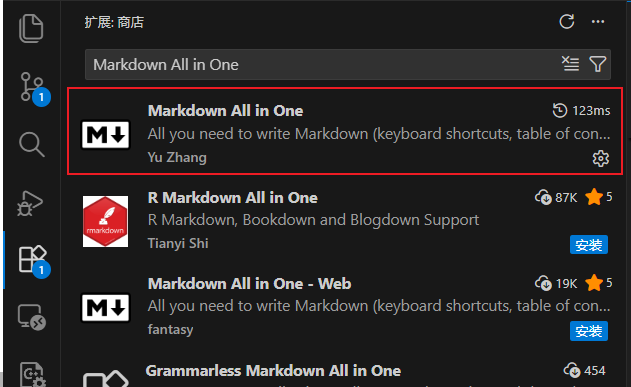
>
> 输入 `Create Table of Contents` 生成目录图片：
>
> 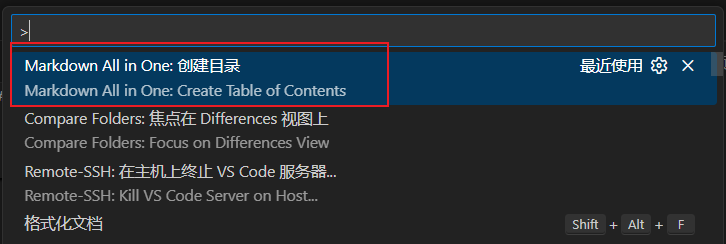
>

# 二、文本格式

## 2.1 换行

Markdown 段落没有特殊的格式，直接编写文字就好。

换行存在以下方法：

1. 硬换行：在行尾添加两个以上空格加上回车，GFM不支持
2. 软换行：在段落间添加一个空行，推荐
3. 标签换行：使用HTML的换行标签`<br>`，`<br/>` 或 `<br />`
4. 反斜杠，在行位添加反斜杠加上回撤，GFM不支持

<br/>

案例：

```
# 方法一：硬换行（Github不生效）
段落1  # 这里添加2个空格
段落2

# 方法二：软换行
段落1 # 换行

段落2

# 方法三：标签换行，使用HTML的换行标签<br>，<br/>或<br />。
段落1 <br/> 段落2

# 方法四，反斜杠换行
段落1\
段落2
```

<br/>

显示效果如下：

> 方法一：硬换行
>
> 段落1  # 这里添加2个空格
> 段落2
>
> 方法二：软换行
>
> 段落1 # 换行
>
> 段落2
>
> 方法三：标签换行，使用HTML的换行标签`<br>`，`<br/>`, `</br>` 或 `<br />`。
>
> 段落1 </br> 段落2
>
> 方法四，反斜杠换行
>
> 段落1\
> 段落2


<br/>

## 2.2 字体格式

### 2.2.1 粗体、斜体、组合

**粗体语法：** 使用两个星号 **\*\*** 或两个下划线 **__** 包围文字：

案例：

```
这是**粗体文字**使用星号
这是 __粗体文字__ 使用下划线
```

<br/>

**斜体语法：** 使用一个星号 **\*** 或一个下划线 **_** 包围文字：

案例：

```
这是*斜体文字*使用星号
这是 _斜体文字_ 使用下划线
```

<br/>

**粗斜体组合：** 使用三个星号 **\*\*\*** 或三个下划线 **___**包围文字：

案例：

```
这是*斜体文本*使用星号
这是 _斜体文本_ 使用下划线

这是**粗体文本**使用星号
这是 __粗体文本__ 使用下划线

这是***粗斜体文本***使用星号
这是 ___粗斜体文本___ 使用下划线
```

<br/>

显示效果如下：

> 这是**粗体文字**使用星号
>
> 这是__粗体文字__使用下划线
>
> 这是 __粗体文字__ 使用下划线
>
> 这是*斜体文字*使用星号
>
> 这是 _斜体文字_ 使用下划线
>
> 这是*斜体文本*使用星号
>
> 这是 _斜体文本_ 使用下划线
>
> 这是**粗体文本**使用星号
>
> 这是 __粗体文本__ 使用下划线
>
> 这是***粗斜体文本***使用星号
>
> 这是 ___粗斜体文本___ 使用下划线
>


<br/>

### 2.2.2 粗体、斜体、组合的注意事项

原始Markdown规范支持 `__粗体__` 语法，但CommonMark（现代标准）中，`__粗体__` 的解析规则比 `**粗体**` 更严格。

根据CommonMark规范，`__粗体__` 语法需要满足:

1. 不能紧邻其他字母/数字（即需要被非单词字符包围）；

2. 单词边界规则：下划线需要被空格、标点、行首/行尾等包围；

<br/>

案例：

```
文本__粗体__文本（无效规则）
文本 __粗体__ 文本（有效规则，前后为空格）
__粗体__。（有效规则，前为行首，后为标点）
1__粗体__2（无效规则）
a__粗体__b（无效规则）
```

<br/>

显示效果如下：

> 文本__粗体__文本（无效规则）
>
> 文本 __粗体__ 文本（有效规则）
>
> __粗体__。（有效规则）
>
> 1__粗体__2（无效规则）
>
> a__粗体__b（无效规则）


<br/>

因此，在设置字体的粗体、斜体时**推荐**使用星号语法。如果使用下划线时，可以在下划线前后加上空格，标点，行首/行尾等。

<br/>

## 2.3 删除线

**删除线语法：** 使用两个波浪号 **~~** 或者`<del>`标签包围文字：


案例：

```
这是~~删除线~~使用波浪号

这是<del>删除线</del>使用波浪号
```


显示效果如下：

> 这是~~删除线~~使用波浪号
>
> 这是<del>删除线</del>使用波浪号
>


<br/>

## 2.4 下划线和上划线

### 2.4.1 下划线

**下划线语法：** Markdown自身没有实现下划线，但支持HTML的`<u>`标签来实现。

然而，传统的Markdown下划线语法`<u>`标签在Github的Markdown文件中不生效，应该使用`<ins>`标签或者Latex公式实现。

<br/>


案例：

```
# 方法一
这是 <u>下划线</u> 使用`<u>`标签
# 方法二
这是 <ins>下划线</ins> 使用`<ins>`标签
# 方法三
这是 $\underline{下划线}$ 使用`$\underline{下划线}$`Latex公式实现

总结:
标准Markdown支持三种方式来显示下划线，但GFM只支持方法二和方法三来显示下划线
```
<br/>


显示效果如下：

> 这是 <u>下划线</u> 使用`<u>`标签
>
> 这是 <ins>下划线</ins> 使用`<ins>`标签
>
> 这是 $\underline{下划线}$ 使用`$\underline{下划线}$`Latex公式实现
>


<br/>

### 2.4.2 上划线

**上划线语法：** 标准Markdown和GFM需要通过Latex公式实现上划线


案例：

```
这是 $\overline{上划线}$ 使用`$\overline{上划线}$`Latex公式实现
```
<br/>


显示效果如下：

> 这是 $\overline{上划线}$ 使用`$\overline{上划线}$`Latex公式实现


<br/>

### 2.4.3 下划线和上划线的注意事项

注意事项：

1. 在使用 `LaTeX` 的 `\underline{}` 和 `\overline{}` 命令来显示下划线和上划线时，可能会出现划线不完整的显示异常；

2. 在 GitHub Flavored Markdown (GFM) 中使用 `LaTeX` 时，某些需要额外 `LaTeX` 包的划线命令无法正常渲染，例如 `\underbracket{}` 命令需要mathtools包, 但是GFM不支持；

<br/>

案例：

```
$\underline{\underline{双下划线文本}}$
$\underline{\underline{\underline{三下划线文本}}}$
$\underbrace{这是大括号下划线}$
$\underleftarrow{这是左箭头下划线}$
$\underrightarrow{这是左箭头下划线}$
$\underleftrightarrow{这是左右箭头下划线}$
$\underline{\text{这是大括号下划线}}$
$$\underline{\text{这是下划线公式}}$$
```

<br/>

显示效果如下：

> $\underline{\underline{双下划线文本}}$
>
> $\underline{\underline{\underline{三下划线文本}}}$
>
> $\underbrace{这是大括号下划线}$
>
> $\underleftarrow{这是左箭头下划线}$
>
> $\underrightarrow{这是左箭头下划线}$
>
> $\underleftrightarrow{这是左右箭头下划线}$
>
> $\underline{\text{这是大括号下划线}}$
>
> $$\underline{\text{这是下划线公式}}$$


## 2.5 上下标

### 2.5.1 上标

上标语法：Markdown可以使用`<sup>`标签、Latex中的`^{text}`命令来实现上标显示

案例：

```
# 方法一
这是^上标^显示
# 方法二
这是<sup>上标</sup>显示
# 方法三
$这是^{上标}显示$

总结：
部分Markdown编辑器（如Typora）支持方法一，Markdown和GFM均支持方法二和方法三，推荐使用方法二
```
<br/>

显示效果如下：

> 这是^上标^显示
>
> 这是<sup>上标</sup>显示
>
> $这是^{上标}显示$


<br/>

### 2.5.2 下标


下标语法：Markdown可以使用`<sub>`标签、Latex中的`_{text}`命令来实现下标显示

<br/>

案例：

```
# 方法一
这是~下标~显示
# 方法二
这是<sub>下标</sub>显示
# 方法三
$这是_{下标}显示$

总结：
部分Markdown编辑器（如Typora）支持方法一，Markdown和GFM均支持方法二和方法三，推荐使用方法二
```

<br/>

显示效果如下：

> 这是~下标~显示
> 
> 这是<sub>下标</sub>显示
> 
> $这是_{下标}显示$

<br/>

## 2.6 分割线

**分割线：** 在单独一行上使用三个或多个星号（`***`）、破折号（`---`）或下划线（`___`），并且不能包含其他内容。


案例：

```
---
***
___
```

显示效果如下：

> ---
> 
> ***
> 
> ___

## 2.7 脚注

脚注：脚注是对文本的补充说明

<br/>

案例：

```
这是一个脚注[^note]。

[^note]: 这是带标签的脚注内容。
    脚注内容可以有多行，需要缩进。
    这是脚注的第二行。
```

<br/>

显示效果如下：

> 这是一个脚注[^note]。
> 
> [^note]: 这是带标签的脚注内容。
>    脚注内容可以有多行，需要缩进。
>    这是脚注的第二行。

<br/>

## 2.8 高亮


案例：

```
# 方法一：扩展, GFM不支持，但Typora等Markdown编辑器支持
这是==高亮文本==

# 方法二：HTML标签
这是<mark>高亮文本</mark>
```

显示效果如下：

> 这是==高亮文本==
> 
> 这是<mark>高亮文本</mark>

<br/>

## 2.9 行内代码标记


案例：

```
这是`行内代码标记`

<code>行内代码标记</code>
```

显示效果如下：

> 这是`行内代码标记`
> 
> 这是<code>行内代码标记</code>

<br/>

## 2.10 块引用

案例：

```
下面是块引用
> 块引用内容
>> 二级块引用内容
```

显示效果如下：

> 下面是块引用
>
> > 块引用内容
> >
> > > 二级块引用内容

<br/>


注意：

1. 块引用支持嵌套使用，为了更好地凸显出显示效果，本文档中的所有显示效果均在块引用中展示。
2. Alerts不支持在块引用显示。


### 2.10.1 Alerts 

Github中存在块引用的扩展，高亮显示注释、警告的选项，这种的在一些Markdown编辑器（如Typora）中不支持。


案例：

```
> [!NOTE]  
> Highlights information that users should take into account, even when skimming.
> 
> 突出显示用户应该考虑的信息，即使在略读时也是如此。

> [!TIP]
> Optional information to help a user be more successful.
> 
> 可选信息，帮助用户更成功。

> [!IMPORTANT]  
> Crucial information necessary for users to succeed.
> 
> 用户成功所需的关键信息。

> [!WARNING]  
> Critical content demanding immediate user attention due to potential risks.
> 
> 由于潜在风险需要用户立即关注的关键内容。

> [!CAUTION]
> Negative potential consequences of an action.
> 
> 一个动作的负面潜在后果。
```

<br/>

显示效果如下：

> [!NOTE]  
> Highlights information that users should take into account, even when skimming.
> 
> 突出显示用户应该考虑的信息，即使在略读时也是如此。

> [!TIP]
> Optional information to help a user be more successful.
> 
> 可选信息，帮助用户更成功。

> [!IMPORTANT]  
> Crucial information necessary for users to succeed.
> 
> 用户成功所需的关键信息。

> [!WARNING]  
> Critical content demanding immediate user attention due to potential risks.
> 
> 由于潜在风险需要用户立即关注的关键内容。

> [!CAUTION]
> Negative potential consequences of an action.
> 
> 一个动作的负面潜在后果。

<br/>

## 2.11 代码块

代码块使用三个反引号（即```）来显示。这种的代码块方式被称为围栏式代码块，在这种围栏式代码块中，可以指定一个可选的语言标识符，在指定后，可以为代码块启动语法着色功能。


注意：在代码块中想显示代码块符号的话，可以使用四个反引号（即````）来包裹。


案例：

````
# 普通代码块
```
这是代码块
```

# 指定c语言的语言标识符
```c
printf("hello world!");
```
````


显示效果如下：

> 普通代码块
>  ```
> 这是代码块
> ```
> 
> 指定c语言的语言标识符
> ```c
> printf("hello world!");
> ```


<br/>


### 2.11.1 diff语法

差异显示是代码审查中的重要功能，使用 diff 语言标识符。

具体实现如8.2节。


## 2.12 颜色

### 2.12.1 字体颜色


Markdown语法中存在多种样式来显示字体颜色：

1. 使用HTML中`<font>`标签, GFM不支持
2. 使用HTML中的`<span>`标签, GFM不支持
3. 使用HTML中的`<div>`标签, GFM不支持
4. 使用Latex公式的`color`或`textcolor`命令

<br/>

注意：颜色支持

```
颜色名: 例如red
rgb颜色: 例如rgb(255, 0, 0)
十六进制颜色值: #FF0000
```

<br/>

案例：

```
这是<font color="red">红色</font>

这是<span style="color:rgb(255, 0, 0)">红色</span>

<div style="color: red;">
  这是一个字体为红色的块，可以包含多行文本。
</div>

这是 $\color{#FF0000}{\mathtt{红色}}$

这是 $\textcolor{red}{\mathtt{红色}}$
```

<br/>

显示效果如下：

> 这是<font color="red">红色</font>
> 
> 这是<span style="color:rgb(255, 0, 0)">红色</span>
>
> <div style="color: red;">
>   这是一个字体为红色的块，可以包含多行文本。
> </div>
> 
> 这是 $\color{#FF0000}{\mathtt{红色}}$
> 
> 这是 $\textcolor{red}{\mathtt{红色}}$

<br/>

### 2.12.2 背景颜色

Markdown语法中存在多种样式来显示字体背景颜色：

1. 使用HTML中`<font>`标签, GFM不支持
2. 使用HTML中的`<span>`标签, GFM不支持
3. 使用HTML中的`<div>`标签, GFM不支持
4. 使用HTML中的`<mark>`标签，GFM不支持修改颜色
5. 使用部分Markdown编辑器（如Typora）支持的扩展高亮语法 `==文本==`, GFM不支持

<br/>

案例：

```
这是 <font style="background: red"> 背景为红色</font>

这是 <span style="background-color: red"> 背景为红色</span>

<div style="background: red;">
  这是一个有背景色的块，可以包含多行文本。
</div>

这是<mark>背景默认为黄色</mark>

这是<mark style="background: red; color: blue">背景为红色</mark>

这是 == 背景为红色 ==
```

<br/>

显示效果如下：

> 这是 <font style="background: red"> 背景为红色</font>
>
> 这是 <span style="background-color: red"> 背景为红色</span>
>
> <div style="background: red;">
>   这是一个有背景色的块，可以包含多行文本。
> </div>
>
> 这是<mark>背景默认为黄色</mark>
>
> 这是<mark style="background: red; color: blue">背景为红色</mark>
> 
> 这是 ==背景为红色==

# 三、列表

## 3.1 无序列表

无序列表使用星号(`*`)、加号(`+`)或是减号(`-`)作为列表标记，这些标记后面要添加一个空格，然后再填写内容

<br/>

案例：

```
+ 无序列表，使用加号

* 无序列表，使用星号

- 无序列表，使用减号
```

<br/>

显示效果如下：

> + 无序列表，使用加号
>
> * 无序列表，使用星号
>
> - 无序列表，使用减号
>

<br/>

## 3.2 有序列表

有序列表使用数字并加上 . 号来表示。

注意：Markdown 会自动修正数字顺序, 但会以第一个数字开始。

案例：

```
2. 有序列表（实际显示为2）

3. 有序列表（修正，实际显示为3）

6. 有序列表（修正，实际显示为4）
```

显示效果如下：

> 2. 有序列表
>
> 3. 有序列表
>
> 6. 有序列表
>

<br/>

## 3.3 任务列表

任务列表

<br/>

案例：

```
- [ ] 未完成的任务
- [x] 已完成的任务
- [ ] 另一个未完成的任务
```

<br/>

显示效果如下：

> - [ ] 未完成的任务
> - [x] 已完成的任务
> - [ ] 另一个未完成的任务

<br/>

## 3.4 列表嵌套

无序列表，有序列表，任务列表，这3者是支持嵌套使用的。

<br/>

案例：

```
+ 无序列表，使用加号
  1. 有序列表
    - [x] 已完成的任务
```

<br/>

显示效果如下：

> + 无序列表，使用加号
>   1. 有序列表
>     - [x] 已完成的任务

<br/>

# 四、链接

## 4.1 网址链接

格式:

```
[alt](URL title)
```

alt和title即对应HTML中的alt和title属性（都可省略）

- alt表示网址链接显示失败时的替换文本

- title表示鼠标悬停在网址链接时的显示文本（注意这里要加引号）

案例：

```
这是一个URL链接: [百度一下](https://www.baidu.com "悬停显示: 百度一下")
```

显示效果如下：

> 这是一个URL链接: [百度一下](https://www.baidu.com "悬停显示: 百度一下")

<br/>

### 4.1.1 网址链接扩展

如果想展示URL的链接地址的话，虽然可以使用上述的网址链接`[alt](url title)`, 将alt的值改成url的网址链接。

案例：

```
这是一个URL链接: [https://www.baidu.com](https://www.baidu.com "悬停显示: 百度一下")
```

显示效果如下：

> 这是一个URL链接: [https://www.baidu.com](https://www.baidu.com "悬停显示: 百度一下")

<br/>

**省略方法：**

使用尖括号可以很方便地把URL或者email地址变成可点击的链接。使用这种方式可以快速达到上述要求。

案例：

```
这是一个URL链接: <https://www.baidu.com>
```

显示效果如下：

> 这是一个URL链接: <https://www.baidu.com>

注意：这种方式适用于URL网址，Email地址等场景

<br/>

## 4.2 文件链接

格式:

```
[alt](URL title)
```

alt和title即对应HTML中的alt和title属性（都可省略）

- alt表示文件链接显示失败时的替换文本
- title表示鼠标悬停在文件链接时的显示文本（注意这里要加引号）

案例：

```
这是一个文件链接: [百度一下](./README.assets/baidu.gif "悬停显示: 百度一下")
```

显示效果如下：

> 这是一个文件链接: [百度一下](./README.assets/baidu.gif "悬停显示: 百度一下")

<br/>

## 4.3 图片链接/插入图片

格式:

```

```

alt和title即对应HTML中的alt和title属性（都可省略）

- alt表示图片显示失败时的替换文本

- title表示鼠标悬停在图片时的显示文本（注意这里要加引号）

案例：

```
这是一个文件链接: 
```

显示效果如下：

> 这是一个文件链接: 

<br/>

### 4.3.1 给图片加链接

格式:

```
[](链接URL)
```

alt和title即对应HTML中的alt和title属性（都可省略）

- alt表示图片显示失败时的替换文本
- title表示鼠标悬停在图片时的显示文本（注意这里要加引号）

案例：

```
这是一个文件链接: [](https://www.baidu.com)
```

显示效果如下：

> 这是一个文件链接: [](https://www.baidu.com)

## 4.4 标题链接

格式:

```
[alt](URL title)
```

alt和title即对应HTML中的alt和title属性（都可省略）

- alt表示标题链接显示失败时的替换文本
- title表示鼠标悬停在标题链接时的显示文本（注意这里要加引号）

案例：

```
标题链接: [1.1 概述](#11-概述 "跳转到1.1节")
```

显示效果如下：

>  标题链接: [1.1 概述](#11-概述 "跳转到1.1节")

<br/>

# 五、图片


在Markdown中，除了用``语法插入静态图片外，还可以用Mermaid语法绘制可编辑的图表，这类图表是“代码生成”的，在渲染时动态生成图片。


## 5.1 插入静态图片


在Markdown中插入图片存在以下方式：

+ 图片链接：具体实现详见4.3节
+ HTML标签：使用``标签

使用图片链接的方法是目前还没有办法指定图片的高度和宽度，因此，如果需要指定图片宽度和高度的话，可以使用``标签。


### 5.1.1 图片链接

详见4.3节

<br/>

### 5.1.2 HTML标签

案例：

```

```

显示效果如下：

> 


具体的标签功能可以查看HTML的语法。

<br/>


## 5.2 插入动态图片

<br/>

Mermaid 是基于 JavaScript 的图表绘制工具，通过简单的文本语法生成专业图表，完全兼容 Markdown。它支持多种图表类型，是当前最流行的 Markdown 图表工具之一。

支持的图表类型

- **流程图** (Flowchart) - 展示流程和决策路径
- **时序图** ( Sequence Diagram) - 显示对象间交互的时间顺序
- **甘特图** (Gantt Chart) - 项目管理和时间规划
- **饼图** (Pie Chart) - 数据占比可视化
- **类图** (Class Diagram) - 面向对象系统结构
- **状态图** (State Diagram) - 系统状态转换
- 更多图表类型详见 5.2.1-5.2.6 节

<br/>

安装步骤：

1. 打开VS Code
2. 进入扩展市场（快捷键：Ctrl+Shift+X）
3. 在搜索栏中输入 `Mermaid`, 推荐安装插件`MArkdown Preview Mermaid Support`，然后点击安装
4. 重新启动VS Code, 在Markdown文件，点击预览即可出现对应的图表

运行截图如下：

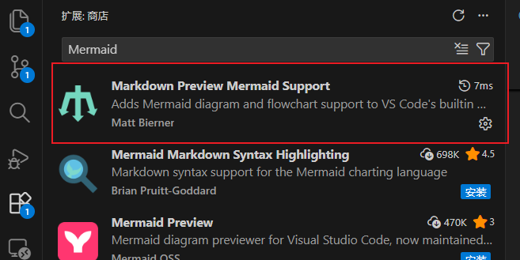


此外，还有一些图也支持，例如flow流程图。

<br/>


### 5.2.1 流程图

案例：

````
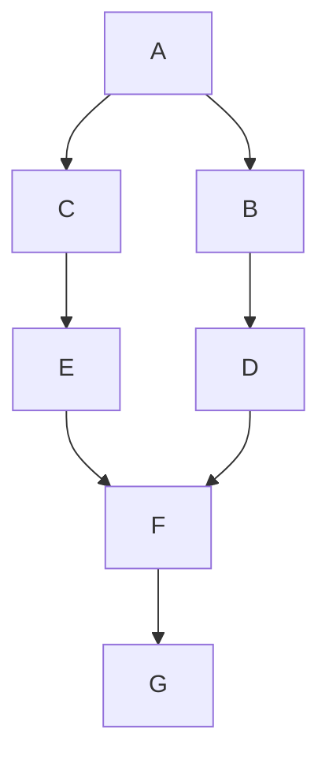
````

显示效果如下：


<br/>

### 5.2.2 时序图

案例：

````
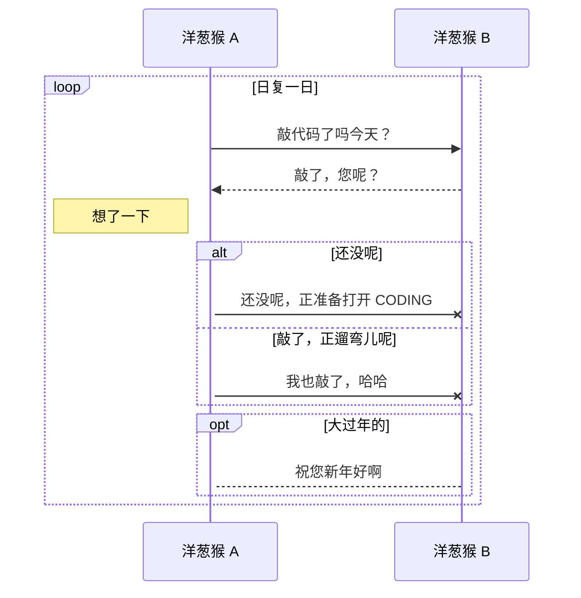
````

显示效果如下：


<br/>

### 5.2.3 甘特图

案例：

````
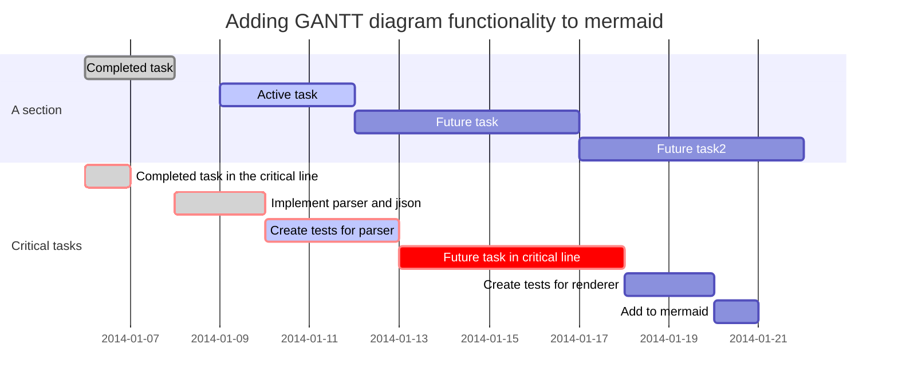
````

显示效果如下：


<br/>

### 5.2.4 饼图

案例：

````
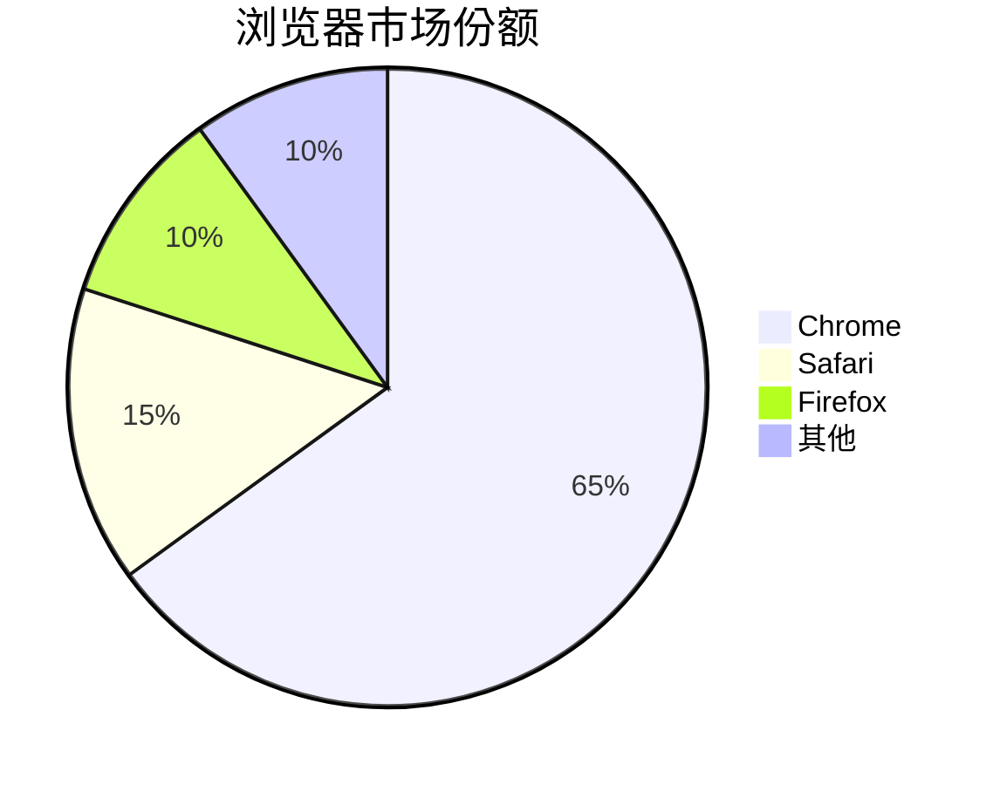
````

显示效果如下：


<br/>

### 5.2.5 类图

案例：

````
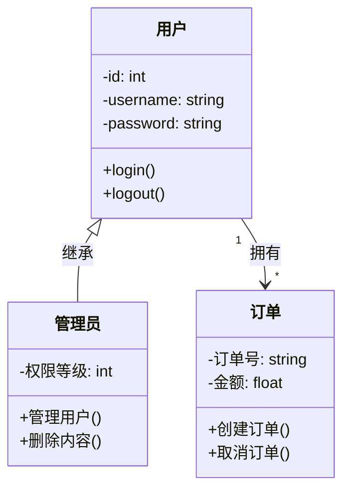
````

显示效果如下：


<br/>

### 5.2.6 状态图

案例：

````
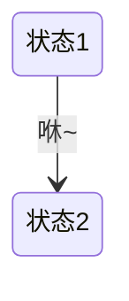
````

显示效果如下：


<br/>

### 5.2.7 flow流程图

Mermaid不支持下面语法，但是部分Markdown编辑器支持，例如Typora。

案例：

````
```flow
st=>start: 开始框
op=>operation: 处理框
cond=>condition: 判断框(是或否?)
sub1=>subroutine: 子流程
io=>inputoutput: 输入输出框
e=>end: 结束框
st(right)->op(right)->cond
cond(yes)->io(bottom)->e
cond(no)->sub1(right)->op
```
````

显示效果如下：

```flow
st=>start: 开始框
op=>operation: 处理框
cond=>condition: 判断框(是或否?)
sub1=>subroutine: 子流程
io=>inputoutput: 输入输出框
e=>end: 结束框
st(right)->op(right)->cond
cond(yes)->io(bottom)->e
cond(no)->sub1(right)->op
```

<br/>


## 5.3 特殊图片


# 六、表格

## 6.1 表格格式与对齐

Markdown 制作表格使用 `|` 来分隔不同的单元格，使用 `-` 来分隔表头和其他行。

语法：

1. 表头和数据行之间必须有分隔线
2. 分隔线至少需要三个连字符 ---
3. 两端的竖线 | 是可选的，但建议保留以提高可读性
4. 通过修改分割线可以设置对齐
    + `:---` 设置内容和标题栏居左对齐
    + `---:` 设置内容和标题栏居右对齐
    + `:---:` 设置内容和标题栏居中对齐

案例：

```
| 表头1  | 表头2|
| ---------- | -----------|
| 表格单元   | 表格单元   |
| 表格单元   | 表格单元   |
```

显示效果如下：

> | 表头1    | 表头2    |
> | -------- | -------- |
> | 表格单元 | 表格单元 |
> | 表格单元 | 表格单元 |

<br/>

## 6.2 HTML表格

复杂表格的创建可以使用 HTML 语法来实现更高级的功能，如单元格合并、自定义样式等

案例：

```html
<table>
  <thead>
    <tr>
      <th rowspan="2">功能模块</th>
      <th colspan="2">开发进度</th>
      <th rowspan="2">负责人</th>
    </tr>
    <tr>
      <th>前端</th>
      <th>后端</th>
    </tr>
  </thead>
  <tbody>
    <tr>
      <td>用户管理</td>
      <td>100%</td>
      <td>100%</td>
      <td>Alice</td>
    </tr>
    <tr>
      <td>数据分析</td>
      <td>80%</td>
      <td>90%</td>
      <td>Bob</td>
    </tr>
  </tbody>
</table>
```

显示效果如下：

> <table>
>   <thead>
>     <tr>
>       <th rowspan="2">功能模块</th>
>       <th colspan="2">开发进度</th>
>       <th rowspan="2">负责人</th>
>     </tr>
>     <tr>
>       <th>前端</th>
>       <th>后端</th>
>     </tr>
>   </thead>
>   <tbody>
>     <tr>
>       <td>用户管理</td>
>       <td>100%</td>
>       <td>100%</td>
>       <td>Alice</td>
>     </tr>
>     <tr>
>       <td>数据分析</td>
>       <td>80%</td>
>       <td>90%</td>
>       <td>Bob</td>
>     </tr>
>   </tbody>
> </table>

<br/>

# 七、数学公式

在 Markdown 中，数学公式通过 LaTeX 语法来表示。

## 7.1 行内公式

行内公式使用单个美元符号 `$` 包围，公式会嵌入到文本中

案例：

```
文本中的变量 $x = 5$ 和函数 $f(x) = x^2 + 2x + 1$。
```

显示效果如下：

文本中的变量 $x = 5$ 和函数 $f(x) = x^2 + 2x + 1$。

<br/>

## 7.2 块级公式

块级公式使用双美元符号 `$$` 包围，公式会独立成行并居中显示

案例：

```
$$E = mc^2$$

$$\int_{-\infty}^{\infty} e^{-x^2} dx = \sqrt{\pi}$$
```

显示效果如下：

$$E = mc^2$$

$$\int_{-\infty}^{\infty} e^{-x^2} dx = \sqrt{\pi}$$

<br/>

## 7.3 多行公式

使用 align 环境创建多行对齐公式


案例：

```
$$
  \begin{align}
  f(x) &= ax^2 + bx + c \\
  f'(x)  &= 2ax + b \\
  f''(x)  &= 2a
  \end{align}
$$
```

显示效果如下：

$$
\begin{align}
  f(x) &= ax^2 + bx + c \\
  f'(x)  &= 2ax + b \\
  f''(x)  &= 2a
  \end{align}
$$

<br/>

## 7.4 公式编号

GFM不支持 `\tag{}`, `\label{}` 和 `\hfill` 来显示公式编号, 但可以使用`&&` 和 `\hspace{}`来实现公式编号的显示。

案例：

```
公式1: `\tag{}` 会乱码

$$E = mc^2  \tag{1} $$

公式2: `\tag{}` 会乱码

$$
\begin{align}
f'(x) = 2ax + b \tag{2} \\
\end{align}
$$

公式3: `\label{}` 在Github上不显示

$$
\begin{align}
y5=x5+z5 \label{Za}\\
y6=x6+z6 \notag \\
y7=x7+z7 \label{Zb}
\end{align}
$$

公式4: `&&` 来间隔公式，Github支持; `\hfill`在Github不支持

$$
\begin{align*}
f(x) &= ax^2 + bx + c && \text{（二次函数）} \\
f'(x) &= 2ax + b \hfill && \text{（一阶导数）} \\
f''(x) &= 2a && \text{（二阶导数）}
\end{align*}
$$

公式5: `\hspace{}`来间隔2个文本，Github支持，但不推荐

$$
\begin{align*}
f(x) &= ax^2 + bx + c \hspace{5cm} \text{（二次函数）} \\
f'(x) &= 2ax + b \hspace{5cm} \text{（一阶导数）} \\
f''(x) &= 2a \hspace{5cm} \text{（二阶导数）}
\end{align*}
$$
```

显示效果如下：

> 公式1: `\tag{}` 会乱码
>
> $$E = mc^2  \tag{1} $$
>
> 公式2: `\tag{}` 会乱码
>
> $$
> \begin{align}
> f'(x) = 2ax + b \tag{2} \\
> \end{align}
> $$
>
> 公式3: `\label{}` 在Github上不显示
>
> $$
> \begin{align}
> y5=x5+z5 \label{Za}\\
> y6=x6+z6 \notag \\
> y7=x7+z7 \label{Zb}
> \end{align}
> $$
>
> 公式4: `&&` 来间隔公式，Github支持; `\hfill`在Github不支持
>
> $$
> \begin{align*}
> f(x) &= ax^2 + bx + c && \text{（二次函数）} \\
> f'(x) &= 2ax + b \hfill && \text{（一阶导数）} \\
> f''(x) &= 2a && \text{（二阶导数）}
> \end{align*}
> $$
>
> 公式5: `\hspace{}`来间隔2个文本，Github支持，但不推荐
>
> $$
> \begin{align*}
> f(x) &= ax^2 + bx + c \hspace{5cm} \text{（二次函数）} \\
> f'(x) &= 2ax + b \hspace{5cm} \text{（一阶导数）} \\
> f''(x) &= 2a \hspace{5cm} \text{（二阶导数）}
> \end{align*}
> $$


<br/>

# 八、Github常见的组件

还有一些非Markdown语法，但是在Github中也很实用的组件

## 8.1 表情和符号

### 8.1.1 emoji表情

来源：[参考网址](https://github.com/guodongxiaren/README)

Github的Markdown语法支持添加emoji表情，输入不同的符号码（两个冒号包围的字符）可以显示出不同的表情。

比如 `:blush:`，可以显示 :blush:。

具体每一个表情的符号码，可以查询GitHub的官方网页<http://www.emoji-cheat-sheet.com>。

但是这个网页每次都打开奇慢。。所以我整理到了本repo中，大家可以直接在此查看[emoji](./material/emoji.md)。

<br/>

### 8.1.2 HTML字符

Github的Markdown语法支持添加HTML支持的字符引用

比如 `&laquo;`, 显示为  &laquo;。

来源：[参考网址](https://html.spec.whatwg.org/multipage/named-characters.html#named-character-references)

但是这个网页每次都打开奇慢。。所以我整理到了本repo中，大家可以直接在此查看[entities](./material/entities.md)。

<br/>

### 8.1.3 特殊符号

Markdown还支持其他的特殊符号，这个可以在一些提供特殊符号的网址上复制接口。

比如 `❿` 显示为❿。

参考链接：
1. https://www.iamwawa.cn/fuhao.html
2. https://m.weixinbiaoqing.com/

<br/>

## 8.2 diff语法

在GFM中经常看到代码差异的显示，这是通过一种特殊的标记来实现的，这种标记可以高亮显示代码的增删改。

在GFM中，我们可以通过以下方式来插入一个diff代码块：
1. 使用三个反引号（```）开始一个代码块，然后在反引号后面写上“diff”
2. 在代码块内部，我们可以按照diff的格式来编写，diff格式如下: 
    - “+”开头的行表示增加, 显示的颜色为绿色（ #116329 ）
    - “-”开头的行表示删除, 显示的颜色为红色（ #82071E ）
    - “!”开头的行表示修改, 显示的颜色为橙色（ #953800 ）
    - “#”开头的行表示删除, 显示的颜色为灰色（ #59636E ）
    - 两组“@@”之间的内容表示变动的位置, 显示的颜色为紫罗兰（ #8250DF ）

<br/>

案例：

````
```diff
古诗
+ 人闲桂花落，
- 夜静春山空。
! 月出惊山鸟，
# 时鸣春涧中。
@@ -1,5 +1,5 @@ 
```
````

显示效果如下：

> ```diff
> 古诗
> + 人闲桂花落，
> - 夜静春山空。
> ! 月出惊山鸟，
> # 时鸣春涧中。
> @@ -1,5 +1,5 @@ 
> ```

<br/>

## 8.3 徽章

GFM中特有的语法，制作徽章的网址：

+ https://shields.io/


案例：

```
# 基础徽章


# 为徽章添加百度链接
[](https://www.baidu.com)

```

显示效果如下：

> 基础徽章
>
> 
>
> 
>
> 为徽章添加百度链接
>
> [](https://www.baidu.com)


常见的徽章使用场景包括：

+ 构建与集成状态（CI/CD)，例如`BUILD: PASSING`， `CI: passing`
+ 测试覆盖率与质量
+ 版本与发布信息，例如React版本，python版本，License版本， release版本等
+ 下载量与流行度，例如star数量，issue数量（开放的数量，关闭的数量），fork数量，贡献者的数量，下载数量等
+ 兼容性信息，支持ubuntu啥的
+ 文档与聊天渠道，例如docs，微信群，知乎，微博，新浪，gitlab等
+ 其他用途，例如demo，sponsor(赞赏)等


## 8.4 star

Github仓库的star历史可以已有的网站：https://star-history.com/

使用方法：
在上述网址中，输入需要显示star历史的git仓库地址，然后复制生成的链接即可。

案例：

```
[](https://www.star-history.com/#cjc-github/GitHub-Flavored-Markdown&type=timeline&logscale&legend=top-left)
```

<br/>

显示效果如下：

> [](https://www.star-history.com/#cjc-github/GitHub-Flavored-Markdown&type=timeline&logscale&legend=top-left)

<br/>

## 8.5 折叠

Markdown作为一种轻量级标记语言，虽然支持HTML语言，但是不鼓励大量使用，但是有些时候HTML的语法可以在写Markdown的时候作为一个合适的补充。HTML语言中的`<details>`标签实现折叠功能。

案例：

```html
<details>
<summary>Linux环境</summary>

##### 编译
xxxx

##### 安装
xxxx
</details>
```

显示效果如下：

> <details>
> <summary>Linux环境</summary>
>
> ##### 编译
> xxxx
>
> ##### 安装
> xxxx
> </details>

<br/>

## 8.6 视频

### 8.6.1 Github上传视频

在Github上将文件上传到md, issues, pull requests, comments时，实际会将文件上传到Amazon S3 bucket, 并提供一个URL（URL格式: `https://github.com/user-attachments/assets/<ID>`）以供访问，而GFM支持嵌入这种形式的视频。

案例：

```
https://github.com/user-attachments/assets/3297aadd-456a-47ce-b21f-1edbecd8cfbc
```

显示效果如下：

> https://github.com/user-attachments/assets/3297aadd-456a-47ce-b21f-1edbecd8cfbc

操作步骤的动画:

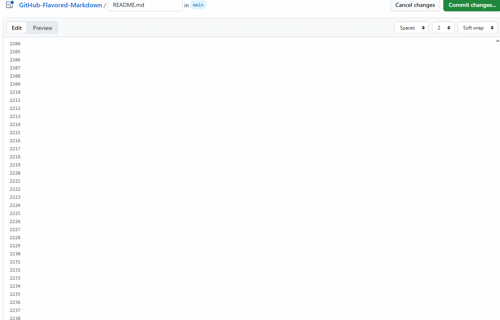

<br/>

### 8.6.2 HTML的视频标签

HTML中的`<video>`标签, 可以实现在HTML中嵌入视频如MP4，但GFM不支持，一些Markdown编辑器（如Typora）支持。

注意：GFM不支持

案例：

```
<video controls width="600">
  <source src="./material/test.mp4" type="video/mp4">
  您的浏览器不支持HTML5 video标签。
</video>
```

显示效果如下：

> 显示
>
> <video controls width="600">
>   <source src="./material/test.mp4" type="video/mp4">
>   您的浏览器不支持HTML5 video标签。
> </video>

<br/>

## 8.7 音频

### 8.7.1 Github上传音频

Github虽然支持8.6.1这种的方式上传音频，但不支持嵌入音频，而是以文件链接的形式展示。

**注意：**
如果想展示音频组件的话，可以考虑上传包含调用音频的HTML文件，或者将音频文件转换为视频文件，然后采用上述方式来展示。

案例：

```
[test.mp3]([./material/test.mp3](https://github.com/user-attachments/files/24295048/test.mp3))
```

显示效果如下：

[test.mp3]([./material/test.mp3](https://github.com/user-attachments/files/24295048/test.mp3))


操作步骤的动画:

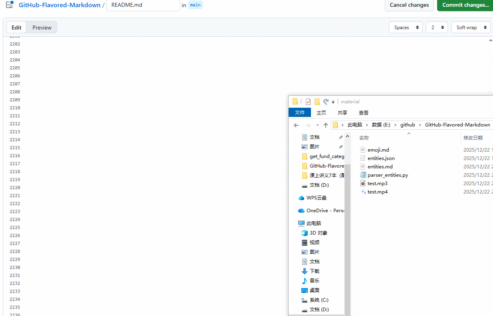

<br/>

### 8.7.2 HTML的音频标签

HTML中的`<audio>`标签, 可以实现在HTML中嵌入音频如MP3，但GFM不支持，一些Markdown编辑器（如Typora）支持。

注意：GFM不支持

案例：

```
<audio controls>
  <source src="./material/test.mp3" type="audio/mpeg">
  您的浏览器不支持HTML5 audio标签。
</audio>
```

显示效果如下：

> 显示 
> 
> <audio controls>
>   <source src="./material/test.mp3" type="audio/mpeg">
>   您的浏览器不支持HTML5 audio标签。
> </audio>

<br/>


# 九、杂项

## 9.1 github markdown暂不支持的功能

+ 目前github暂时不支持css语法，如字体颜色、字体等
+ 目前github不支持文本块行号显示
+ 目前github不支持代码块自动换行、行号显示
+ 目前github不支持嵌入音频组件显示