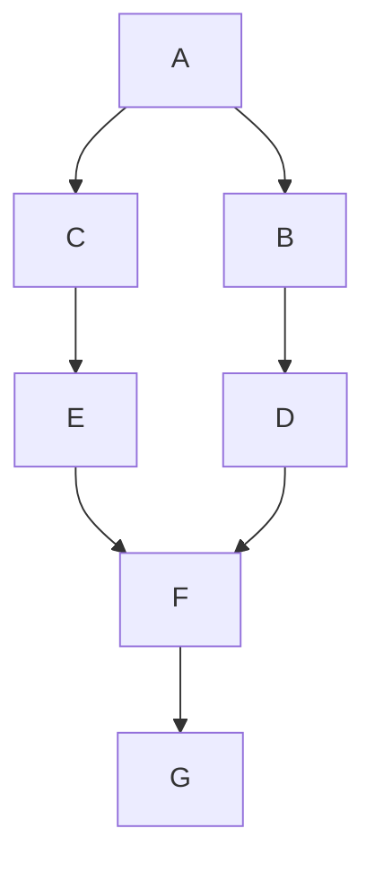
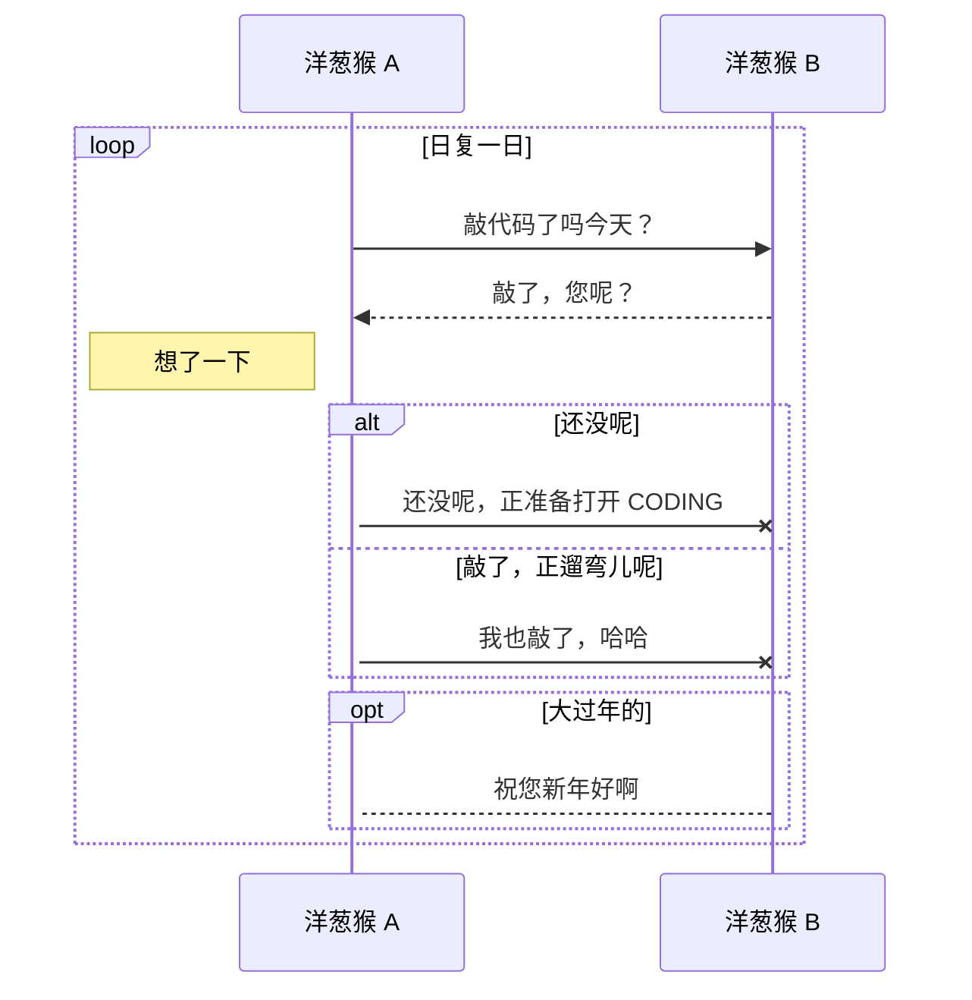
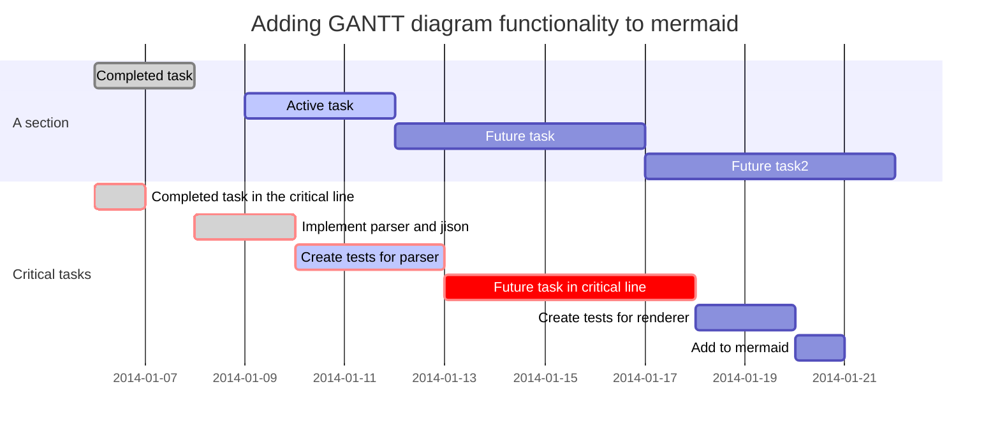
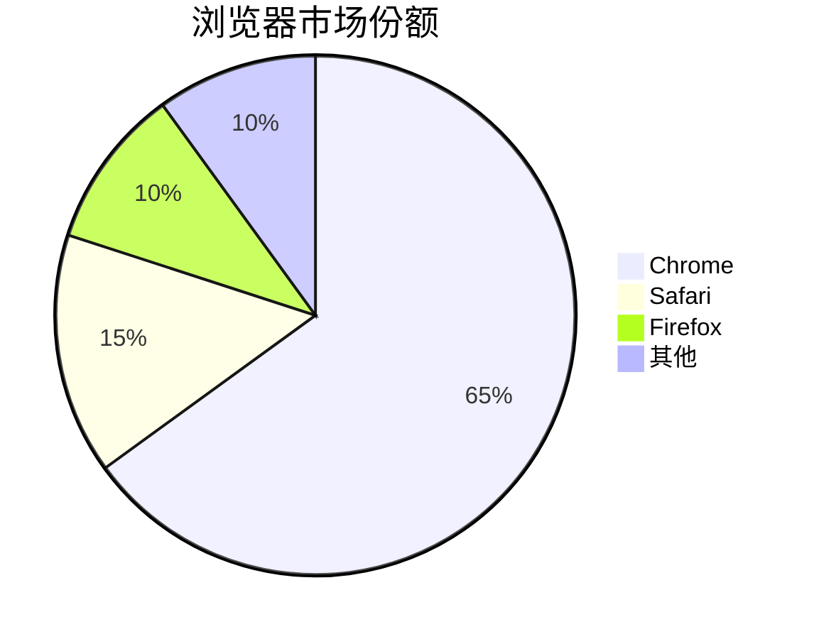
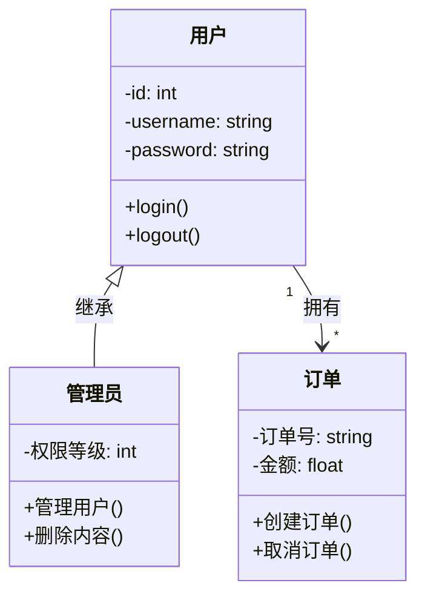
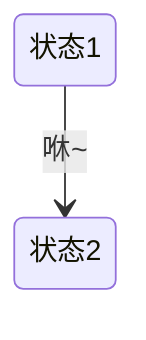

# GitHub Flavored Markdown (GFM) 语法文档

本文档系统性地整理了 GitHub Flavored Markdown (GFM) 的语法规范，并特别标注了与标准 Markdown 语法的差异。

## 1.1 概述

**GitHub Flavored Markdown (GFM)** 是 GitHub 平台在标准 Markdown 基础上扩展的方言，现已成为 GitHub.com 和 GitHub Enterprise 的默认标记语言。凭借 GitHub 在开发者社区的广泛影响力，GFM 的语法规范已被众多平台、编辑器和工具采纳为事实标准或兼容标准。

<br/>

Markdown本身是一种轻量级标记语言，它支持一些简单的格式。然后，各种平台和扩展（如GitHub Flavored Markdown, GFM）又增加了额外的语法。此外，Markdown允许内嵌HTML标签和LaTeX公式（但取决于渲染引擎是否支持）。

我们可以将Markdown支持的格式分为几个层次：

1. 原生Markdown语法（CommonMark标准）
2. GFM（GitHub Flavored Markdown）扩展语法
3. 内嵌HTML标签
4. LaTeX数学公式（GFM通过通过MathJax引擎渲染LaTeX数学表达式）

<br/>

> Github支持LaTex来源 (2022-05-19)：
> 
> https://docs.github.com/zh/get-started/writing-on-github/working-with-advanced-formatting/writing-mathematical-expressions

## 1.2 文档特色

考虑到 GFM 与标准 Markdown 在语法细节上存在显著差异，本仓库致力于：

1. **全面收录 GFM 语法特性**，提供清晰的使用示例
2. **明确标注语法差异**，对比 GFM 与标准 Markdown 的不同实现
3. **提供实用参考**，帮助开发者高效撰写 GitHub 平台上的各类文档

## 1.3 相关资源

### 1.3.1 GFM官方与社区资源

- Github官方文档：https://github.github.com/gfm/
- 社区维护的GFM参考：https://github.com/cjc-github/GitHub-Flavored-Markdown

### 1.3.2 标准Markdown资源

- CommonMark 规范：https://commonmark.org/
- 社区维护的 Markdown 指南：https://github.com/younghz/Markdown

# 目录

- [GitHub Flavored Markdown (GFM) 语法文档](#github-flavored-markdown-gfm-语法文档)
  - [1.1 概述](#11-概述)
  - [1.2 文档特色](#12-文档特色)
  - [1.3 相关资源](#13-相关资源)
    - [1.3.1 GFM官方与社区资源](#131-gfm官方与社区资源)
    - [1.3.2 标准Markdown资源](#132-标准markdown资源)
- [目录](#目录)
- [一、标题](#一标题)
  - [1.1 标题](#11-标题)
    - [1.1.1 Markdown语法实现方式](#111-markdown语法实现方式)
      - [方法一：使用 `=` 和 `-` 符号来标记一级和二级标题](#方法一使用--和---符号来标记一级和二级标题)
      - [方法二：使用 `#` 号标记](#方法二使用--号标记)
    - [1.1.2 HTML标签实现方式](#112-html标签实现方式)
    - [1.1.3 Latex公式实现方式](#113-latex公式实现方式)
  - [1.2 目录生成](#12-目录生成)
    - [1.2.1 Markdown语法实现方式](#121-markdown语法实现方式)
      - [方法一：TOC语法](#方法一toc语法)
      - [方法二：链接方式制作目录](#方法二链接方式制作目录)
      - [方法三：使用插件制作目录](#方法三使用插件制作目录)
- [二、文本格式](#二文本格式)
  - [2.1 换行](#21-换行)
    - [2.1.1 Markdown语法实现方式](#211-markdown语法实现方式)
    - [2.1.2 HTML标签实现方式](#212-html标签实现方式)
    - [2.1.3 Latex公式实现方式](#213-latex公式实现方式)
  - [2.2 字体格式](#22-字体格式)
    - [2.2.1 Markdown语法实现方式](#221-markdown语法实现方式)
    - [2.2.2 HTML标签实现方式](#222-html标签实现方式)
    - [2.2.3 Latex公式实现方式](#223-latex公式实现方式)
  - [2.3 删除线](#23-删除线)
    - [2.3.1 Markdown语法实现方式](#231-markdown语法实现方式)
    - [2.3.2 HTML标签实现方式](#232-html标签实现方式)
    - [2.3.3 Latex公式实现方式](#233-latex公式实现方式)
  - [2.4 下划线和上划线](#24-下划线和上划线)
    - [2.4.1 Markdown语法实现方式](#241-markdown语法实现方式)
    - [2.4.2 HTML标签实现方式](#242-html标签实现方式)
    - [2.4.3 Latex公式实现方式](#243-latex公式实现方式)
  - [2.5 上下标](#25-上下标)
    - [2.5.1 Markdown语法实现方式](#251-markdown语法实现方式)
    - [2.5.2 HTML标签实现方式](#252-html标签实现方式)
    - [2.5.3 Latex公式实现方式](#253-latex公式实现方式)
  - [2.6 分割线](#26-分割线)
    - [2.6.1 Markdown语法实现方式](#261-markdown语法实现方式)
    - [2.6.2 HTML标签实现方式](#262-html标签实现方式)
    - [2.6.3 Latex公式实现方式](#263-latex公式实现方式)
  - [2.7 脚注](#27-脚注)
    - [2.7.1 Markdown语法实现方式](#271-markdown语法实现方式)
    - [2.7.2 HTML标签实现方式](#272-html标签实现方式)
    - [2.7.3 Latex公式实现方式](#273-latex公式实现方式)
  - [2.8 高亮](#28-高亮)
  - [2.8.1 Markdown语法实现方式](#281-markdown语法实现方式)
  - [2.8.2 HTML标签实现方式](#282-html标签实现方式)
  - [2.8.3 Latex公式实现方式](#283-latex公式实现方式)
  - [2.9 行内代码标记](#29-行内代码标记)
    - [2.9.1 Markdown语法实现方式](#291-markdown语法实现方式)
    - [2.9.2 HTML标签实现方式](#292-html标签实现方式)
    - [2.9.3 Latex公式实现方式](#293-latex公式实现方式)
  - [2.10 块引用](#210-块引用)
    - [2.10.1 Markdown语法实现方式](#2101-markdown语法实现方式)
      - [GFM独有的Alerts](#gfm独有的alerts)
    - [2.10.2 HTML标签实现方式](#2102-html标签实现方式)
    - [2.10.3 Latex公式实现方式](#2103-latex公式实现方式)
  - [2.11 代码块](#211-代码块)
    - [2.11.1](#2111)
      - [差异显示-diff语法](#差异显示-diff语法)
    - [2.11.2 HTML标签实现方式](#2112-html标签实现方式)
    - [2.11.3 Latex公式实现方式](#2113-latex公式实现方式)
  - [2.12 字体颜色](#212-字体颜色)
    - [2.12.1 Markdown语法实现方式](#2121-markdown语法实现方式)
    - [2.12.2 HTML标签实现方式](#2122-html标签实现方式)
    - [2.12.3 Latex公式实现方式](#2123-latex公式实现方式)
  - [2.13 背景颜色](#213-背景颜色)
    - [2.13.1 Markdown语法实现方式](#2131-markdown语法实现方式)
    - [2.13.2 HTML标签实现方式](#2132-html标签实现方式)
- [三、列表](#三列表)
  - [3.1 无序列表](#31-无序列表)
  - [3.2 有序列表](#32-有序列表)
  - [3.3 任务列表](#33-任务列表)
  - [3.4 列表嵌套](#34-列表嵌套)
- [四、链接](#四链接)
  - [4.1 网址链接](#41-网址链接)
    - [4.1.1 网址链接扩展](#411-网址链接扩展)
  - [4.2 文件链接](#42-文件链接)
  - [4.3 图片链接/插入图片](#43-图片链接插入图片)
    - [4.3.1 给图片加链接](#431-给图片加链接)
  - [4.4 标题链接](#44-标题链接)
- [五、图片](#五图片)
  - [5.1 插入静态图片](#51-插入静态图片)
    - [5.1.1 图片链接](#511-图片链接)
    - [5.1.2 HTML标签](#512-html标签)
  - [5.2 插入动态图片](#52-插入动态图片)
    - [5.2.1 流程图](#521-流程图)
    - [5.2.2 时序图](#522-时序图)
    - [5.2.3 甘特图](#523-甘特图)
    - [5.2.4 饼图](#524-饼图)
    - [5.2.5 类图](#525-类图)
    - [5.2.6 状态图](#526-状态图)
    - [5.2.7 flow流程图](#527-flow流程图)
  - [5.3 特殊图片](#53-特殊图片)
- [六、表格](#六表格)
  - [6.1 表格格式与对齐](#61-表格格式与对齐)
  - [6.2 HTML表格](#62-html表格)
- [七、数学公式](#七数学公式)
  - [7.1 行内公式](#71-行内公式)
  - [7.2 块级公式](#72-块级公式)
  - [7.3 多行公式](#73-多行公式)
  - [7.4 公式编号](#74-公式编号)
- [八、Github常见的组件](#八github常见的组件)
  - [8.1 表情和符号](#81-表情和符号)
    - [8.1.1 emoji表情](#811-emoji表情)
    - [8.1.2 HTML字符](#812-html字符)
    - [8.1.3 特殊符号](#813-特殊符号)
  - [8.2 diff语法](#82-diff语法)
  - [8.3 徽章](#83-徽章)
    - [8.3.1 构建与集成状态](#831-构建与集成状态)
    - [8.3.2 测试覆盖率与质量](#832-测试覆盖率与质量)
    - [8.3.3 版本与发布信息](#833-版本与发布信息)
    - [8.3.4 Github仓库数据](#834-github仓库数据)
    - [8.3.5 兼容性信息](#835-兼容性信息)
    - [8.3.6 文档与聊天渠道](#836-文档与聊天渠道)
    - [8.3.7 其他用途](#837-其他用途)
  - [8.4 Github数据图](#84-github数据图)
    - [8.4.1 star历史图](#841-star历史图)
    - [8.4.2 contribution贡献图](#842-contribution贡献图)
  - [8.5 折叠](#85-折叠)
  - [8.6 视频](#86-视频)
    - [8.6.1 Github上传视频](#861-github上传视频)
    - [8.6.2 HTML的视频标签](#862-html的视频标签)
  - [8.7 音频](#87-音频)
    - [8.7.1 Github上传音频](#871-github上传音频)
    - [8.7.2 HTML的音频标签](#872-html的音频标签)
- [九、杂项](#九杂项)
  - [9.1 github markdown暂不支持的功能](#91-github-markdown暂不支持的功能)
  - [9.2 支持情况与实现方法总结](#92-支持情况与实现方法总结)

<br/>

# 一、标题

## 1.1 标题

Markdown标题有以下几种格式：

1. 使用 = 和 - 符号来标记一级和二级标题；
2. 使用 #  号标记标题
3. 使用HTML中的`<h1>`到`<h6>`标签


### 1.1.1 Markdown语法实现方式

Markdown语法支持的标题有以下几种格式：
1. 使用 `=` 和 `-` 符号来标记一级和二级标题；
2. 使用 `# ` 号标记标题

<br/>

#### 方法一：使用 `=` 和 `-` 符号来标记一级和二级标题

注意：

1. 使用 `=` 和 `-` 符号来标记一级和二级标题，在GFM中显示是正常的，但是在一些Markdown编辑器中可能渲染失败，例如Typora。推荐使用 `#` 号标记来创建标题。

<br/>

案例：

```markdown
一级标题
=
二级标题
-
```

<br/>

显示效果如下：

> 一级标题
> =
> 二级标题
> -

<br/>

运行截图如下：


<br/>

#### 方法二：使用 `#` 号标记

Markdown 使用 `#` 号来创建标题，这是从 HTML 的 `<h1>` 到 `<h6>` 标签概念演化而来的。

使用 `#` 号可表示 1-6 级标题，一级标题对应一个 `#` 号，二级标题对应两个 `#` 号，以此类推。

<br/>

案例：

```markdown
# 一级标题
## 二级标题
### 三级标题
#### 四级标题
##### 五级标题
###### 六级标题
```

<br/>

显示效果如下：

> # 一级标题
> ## 二级标题
> ### 三级标题
> #### 四级标题
> ##### 五级标题
> ###### 六级标题

<br/>

运行截图如下：


<br/>

### 1.1.2 HTML标签实现方式

HTML使用`<h1>`到`<h6>`标签来实现不同的标题等级。

案例：

```markdown
<h1>一级标题</h1>
<h2>二级标题</h2>
<h3>三级标题</h3>
<h4>四级标题</h4>
<h5>五级标题</h5>
<h6>六级标题</h6>
```

<br/>

显示效果如下：

> <h1>一级标题</h1>
> <h2>二级标题</h2>
> <h3>三级标题</h3>
> <h4>四级标题</h4>
> <h5>五级标题</h5>
> <h6>六级标题</h6>

### 1.1.3 Latex公式实现方式

Latex中存在多种章节标签来定义文档的结构，常见的命令有`\chapter{}`, `\section{}`, `\subsection{}`, `\subsubsection{}`, `\paragraph{}`, `\subparagraph{}`, `\part{}`等。

注意：在GFM中不支持这种实现方式。

## 1.2 目录生成

### 1.2.1 Markdown语法实现方式

#### 方法一：TOC语法

`[TOC]` 是许多 Markdown 编辑器和渲染器支持的非标准扩展语法，用于在文档开头自动生成基于 `#` 标题的目录。然而，`GitHub Flavored Markdown (GFM) `并不支持使用`[TOC]` 自动生成目录。在指定段落中，输入`[TOC]` 即可渲染展示当前Markdown文件的目录。

非标准扩展语法，不推荐使用。

<br/>

案例：

```markdown
[TOC]
```

<br/>

显示效果如下：

> [TOC]

<br/>

#### 方法二：链接方式制作目录

虽然大多数 Markdown 处理器会自动为标题创建锚点，便于页面内跳转，并在这个基础上结合列表实现了目录（即目录链接）。

<br/>

语法：

```markdown
[标题显示名称](#标题实际跳转的名称)
```

<br/>

案例：

```markdown
- [GitHub Flavored Markdown (GFM) 语法文档](#github-flavored-markdown-gfm-语法文档)
  - [1.1 概述](#11-概述)
```

<br/>

显示效果如下：

> - [GitHub Flavored Markdown (GFM) 语法文档](#github-flavored-markdown-gfm-语法文档)
>   - [1.1 概述](#11-概述)

<br/>

#### 方法三：使用插件制作目录

以VS Code为例，`Markdown All in One`​ 是 VS Code 中功能强大的 Markdown 增强插件，提供了自动生成和更新目录的功能。

<br/>

安装步骤：

1. 打开VS Code
2. 进入扩展市场（快捷键：Ctrl+Shift+X）
3. 搜索 `Markdown All in One`, 点击安装

<br/>

使用步骤：

1. 打开要添加目录的 Markdown 文件
2. 按下快捷键：`Ctrl + Shift + P` 打开命令面板
3. 输入 `Create Table of Contents` 并选择该命令
4. 插件会在当前光标位置自动生成目录

`Markdown All in One` 支持修改文档标题后，目录会自动同步更新。 

<br/>

操作步骤：

> 搜索 `Markdown All in One` 图片：
>
> 
>
> 输入 `Create Table of Contents` 生成目录图片：
>
> 

# 二、文本格式

## 2.1 换行

### 2.1.1 Markdown语法实现方式

Markdown 段落没有特殊的格式，直接编写文字就好。

换行存在以下方法：

1. 硬换行：在行尾添加两个以上空格加上回车，GFM不支持
2. 软换行：在段落间添加一个空行，推荐
3. 反斜杠，在行尾添加反斜杠加上回车，GFM不支持

<br/>

案例：

```markdown
# 方法一：硬换行（Github不生效）
段落1  # 这里添加2个空格
段落2

# 方法二：软换行
段落1 # 换行

段落2

# 方法三，反斜杠换行
段落1\
段落2
```

<br/>

显示效果如下：

> 方法一：硬换行
>
> 段落1  # 这里添加2个空格
> 段落2
>
> 方法二：软换行
>
> 段落1 # 换行
>
> 段落2
>
> 方法三，反斜杠换行
>
> 段落1\
> 段落2

<br/>

### 2.1.2 HTML标签实现方式

标签换行：使用HTML的换行标签<br>，<br/> 或 <br />

案例：

```markdown
# 方法：标签换行，使用HTML的换行标签<br>，<br/>, </br>或<br />。
段落1 <br/> 段落2
```
<br/>

显示效果如下：

> 方法三：标签换行，使用HTML的换行标签`<br>`，`<br/>`, `</br>` 或 `<br />`。
>
> 段落1 </br> 段落2


### 2.1.3 Latex公式实现方式

暂无


## 2.2 字体格式

字体格式

### 2.2.1 Markdown语法实现方式

**粗体语法：** 使用两个星号 `**` 或两个下划线 `__` 包围文字：

案例：

```markdown
这是**粗体文字**使用星号
这是 __粗体文字__ 使用下划线
```

显示效果如下：

> 这是**粗体文字**使用星号
>
> 这是 __粗体文字__ 使用下划线

<br/>

**斜体语法：** 使用一个星号 `*` 或一个下划线 `_` 包围文字：

案例：

```markdown
这是*斜体文字*使用星号
这是 _斜体文字_ 使用下划线
```

显示效果如下：

> 这是*斜体文字*使用星号
>
> 这是 _斜体文字_ 使用下划线

<br/>

**粗斜体组合：** 使用三个星号 `***` 或三个下划线 `___` 包围文字：

案例：

```markdown
这是*斜体文本*使用星号
这是 _斜体文本_ 使用下划线

这是**粗体文本**使用星号
这是 __粗体文本__ 使用下划线

这是***粗斜体文本***使用星号
这是 ___粗斜体文本___ 使用下划线
```

<br/>

显示效果如下：

> 这是*斜体文本*使用星号
>
> 这是 _斜体文本_ 使用下划线
>
> 这是**粗体文本**使用星号
>
> 这是 __粗体文本__ 使用下划线
>
> 这是***粗斜体文本***使用星号
>
> 这是 ___粗斜体文本___ 使用下划线

<br/>


**注意事项**

原始Markdown规范支持 `__粗体__` 语法，但CommonMark（现代标准）中，`__粗体__` 的解析规则比 `**粗体**` 更严格。

根据CommonMark规范，`__粗体__` 语法需要满足:

1. 不能紧邻其他字母/数字（即需要被非单词字符包围）；

2. 单词边界规则：下划线需要被空格、标点、行首/行尾等包围；

<br/>

案例：

```markdown
文本__粗体__文本（无效规则）
文本 __粗体__ 文本（有效规则，前后为空格）
__粗体__。（有效规则，前为行首，后为标点）
1__粗体__2（无效规则）
a__粗体__b（无效规则）
```

<br/>

显示效果如下：

> 文本__粗体__文本（无效规则）
>
> 文本 __粗体__ 文本（有效规则）
>
> __粗体__。（有效规则）
>
> 1__粗体__2（无效规则）
>
> a__粗体__b（无效规则）

<br/>

因此，在设置字体的粗体、斜体时**推荐**使用星号语法。如果使用下划线时，可以在下划线前后加上空格，标点，行首/行尾等。

<br/>

### 2.2.2 HTML标签实现方式

HTML也可以实现上述效果，`<b>`标签和`<strong>`标签效果相同，都是粗体，`<i>`标签和`<em>`标签效果相同，都是斜体。

案例：

```markdown
这是<b>粗体文本</b>
这是<strong>粗体文本</strong>
这是<i>斜体文本</i>
这是<em>斜体文本</em>
这是<b><i>粗斜体文本</i></b>
```

显示效果如下：

> 这是<b>粗体文本</b>
> 
> 这是<strong>粗体文本</strong>
>
> 这是<i>斜体文本</i>
> 
> 这是<em>斜体文本</em>
>
> 这是<b><i>粗斜体文本</i></b>

<br/>

### 2.2.3 Latex公式实现方式

暂无


## 2.3 删除线

### 2.3.1 Markdown语法实现方式

**删除线语法：** 使用两个波浪号 **~~** 包围文字：

案例：

```markdown
这是~~删除线~~使用波浪号
```

显示效果如下：

> 这是~~删除线~~使用波浪号

<br/>

### 2.3.2 HTML标签实现方式

**删除线语法：** 使用`<del>`标签包围文字：

案例：

```markdown
这是<del>删除线</del>使用波浪号
```

显示效果如下：

> 这是<del>删除线</del>使用波浪号

<br/>

### 2.3.3 Latex公式实现方式

暂无

## 2.4 下划线和上划线

### 2.4.1 Markdown语法实现方式

Markdown语法不支持下划线和上划线显示

### 2.4.2 HTML标签实现方式

**下划线语法：** Markdown自身没有实现下划线，但支持HTML的`<u>`标签来实现。

然而，传统的Markdown下划线语法`<u>`标签在Github的Markdown文件中不生效，应该使用`<ins>`标签或者Latex公式实现。

<br/>

案例：

```markdown
# 方法一
这是 <u>下划线</u> 使用`<u>`标签
# 方法二
这是 <ins>下划线</ins> 使用`<ins>`标签

注意：GFM只支持方法二来显示下划线
```
<br/>

显示效果如下：

> 这是 <u>下划线</u> 使用`<u>`标签
>
> 这是 <ins>下划线</ins> 使用`<ins>`标签
>
> 这是 $\underline{下划线}$ 使用`$\underline{下划线}$`Latex公式实现

<br/>

### 2.4.3 Latex公式实现方式

Latex公式使用 `$\underline{}` 和 `$\overline{}` 实现下划线和上划线的渲染。

案例：

```markdown
# 方法一
这是 $\underline{下划线}$ 使用`$\underline{下划线}$`Latex公式实现

这是 $\overline{上划线}$ 使用`$\overline{上划线}$`Latex公式实现
```
<br/>

显示效果如下：

> 这是 $\underline{下划线}$ 使用`$\underline{下划线}$`Latex公式实现
>
> 这是 $\overline{上划线}$ 使用`$\overline{上划线}$`Latex公式实现

<br/>

注意事项：

1. 在使用 `LaTeX` 的 `\underline{}` 和 `\overline{}` 命令来显示下划线和上划线时，可能会出现划线不完整的显示异常；

2. 在 GitHub Flavored Markdown (GFM) 中使用 `LaTeX` 时，某些需要额外 `LaTeX` 包的划线命令无法正常渲染，例如 `\underbracket{}` 命令需要mathtools包, 但是GFM不支持；

<br/>

案例：

```markdown
$\underline{\underline{双下划线文本}}$
$\underline{\underline{\underline{三下划线文本}}}$
$\underbrace{这是大括号下划线}$
$\underleftarrow{这是左箭头下划线}$
$\underrightarrow{这是左箭头下划线}$
$\underleftrightarrow{这是左右箭头下划线}$
$\underline{\text{这是大括号下划线}}$
$$\underline{\text{这是下划线公式}}$$
```

<br/>

显示效果如下：

> $\underline{\underline{双下划线文本}}$
>
> $\underline{\underline{\underline{三下划线文本}}}$
>
> $\underbrace{这是大括号下划线}$
>
> $\underleftarrow{这是左箭头下划线}$
>
> $\underrightarrow{这是左箭头下划线}$
>
> $\underleftrightarrow{这是左右箭头下划线}$
>
> $\underline{\text{这是大括号下划线}}$
>
> $$\underline{\text{这是下划线公式}}$$

## 2.5 上下标

### 2.5.1 Markdown语法实现方式

案例：

```markdown
这是^上标^显示

这是~下标~显示

总结：
部分Markdown编辑器（如Typora）支持
```
<br/>

显示效果如下：

> 这是^上标^显示
>
> 这是~下标~显示


<br/>

### 2.5.2 HTML标签实现方式

HTML中使用`<sup>`标签来实现上标、使用`<sub>`标签来实现下标。

案例：

```markdown
这是<sup>上标</sup>显示

这是<sub>下标</sub>显示
```
<br/>

显示效果如下：


> 这是<sup>上标</sup>显示
> 
> 这是<sub>下标</sub>显示

<br/>


### 2.5.3 Latex公式实现方式


Latex中使用`^{text}`命令来实现上标显示，使用`_{text}`命令来实现下标显示

案例：

```markdown
$这是^{上标}显示$

$这是_{下标}显示$
```
<br/>

显示效果如下：

> $这是^{上标}显示$
>
> $这是_{下标}显示$

<br/>


## 2.6 分割线

### 2.6.1 Markdown语法实现方式


**分割线：** 在单独一行上使用三个或多个星号（`***`）、破折号（`---`）或下划线（`___`），并且不能包含其他内容。

案例：

```markdown
---
***
___
```

显示效果如下：

> ---
> 
> ***
> 
> ___


### 2.6.2 HTML标签实现方式

HTML中使用 `<hr>` 标签来实现分割线，hr全程为（Horizontal Rule，水平分割线）

案例：

```markdown
段落A
<hr>
段落B
```

显示效果如下：

> 段落A
> <hr>
> 段落B

### 2.6.3 Latex公式实现方式

Latex中使用`\rule`命令来绘制分割线

`\rule`命令的格式如下：

```
\rule[lift]{width}{height}
lift‌（可选）：指定矩形基线相对于当前文本基线的垂直偏移量。正值向上抬升，负值向下降低。默认为 0pt。
‌width‌：矩形的宽度。
‌height‌：矩形的高度。
```

案例：

```markdown

段落A

$\rule{33cm}{0.5pt}$

段落B
```
<br/>

显示效果如下：

> 段落A
>
> $\rule{33cm}{0.5pt}$
>
> 段落B


<br/>


## 2.7 脚注

脚注：脚注是对文本的补充说明

### 2.7.1 Markdown语法实现方式

Markdown 没有官方统一的脚注标准，但绝大多数主流编辑器 / 平台（如 Typora、GitHub、VS Code）都支持 GFM (GitHub Flavored Markdown) 风格的脚注语法，核心是「脚注标记 + 脚注内容」的组合。GFM支持这种渲染。

<br/>

案例：

```markdown
这是一个脚注[^note]。

[^note]: 这是带标签的脚注内容。
    脚注内容可以有多行，需要缩进。
    这是脚注的第二行。
```

<br/>

显示效果如下：

> 这是一个脚注[^note]。
> 
> [^note]: 这是带标签的脚注内容。
>    脚注内容可以有多行，需要缩进。
>    这是脚注的第二行。

<br/>

### 2.7.2 HTML标签实现方式

HTML 主要通过 `<sup>`（上标）+ 锚点链接 `<a>` 实现脚注，分「正文标记」和「脚注内容」两部分。GFM支持这种渲染。


```markdown
<p>地铁车厢里的大风主要来自隧道活塞效应<sup id="ref1"><a href="#fn1">1</a></sup>，其次是空调通风系统<sup id="ref2"><a href="#fn2">2</a></sup>。</p>

<div id="footnotes">
  <h3>脚注</h3>
  <ol>
    <li id="fn1">
      活塞效应指列车在隧道中高速行驶时，像活塞一样挤压空气形成的强气流，是车厢大风的核心来源。
      <a href="#ref1">↩</a> <!-- 返回正文锚点 -->
    </li>
    <li id="fn2">
      空调系统会持续向车厢送入新风，形成稳定的背景风，风感相对柔和。
      <a href="#ref2">↩</a>
    </li>
  </ol>
</div>
```

显示效果如下：

> <p>地铁车厢里的大风主要来自隧道活塞效应<sup id="ref1"><a href="#fn1">1</a></sup>，其次是空调通风系统<sup id="ref2"><a href="#fn2">2</a></sup>。</p>
>
> <div id="footnotes">
>  <h3>脚注</h3>
>  <ol>
>   <li id="fn1">
>    活塞效应指列车在隧道中高速行驶时，像活塞一样挤压空气形成的强气流，是车厢大风的核心来源。
> ​      <a href="#ref1">↩</a> <!-- 返回正文锚点 -->
>   </li>
>   <li id="fn2">
>    空调系统会持续向车厢送入新风，形成稳定的背景风，风感相对柔和。
> ​      <a href="#ref2">↩</a>
>   </li>
>  </ol>
> </div>

<br/>

### 2.7.3 Latex公式实现方式

LaTeX 提供原生的 `\footnote{}` 命令，用法最简单，编译后会自动编号并将脚注放在当前页面底部。但是GFM不支持渲染。

案例：

```markdown
地铁车厢里的大风主要来自隧道活塞效应$\footnote{活塞效应指列车在隧道中高速行驶时，像活塞一样挤压空气形成的强气流，是车厢大风的核心来源。}$，其次是空调通风系统$\footnote{空调系统会持续向车厢送入新风，形成稳定的背景风，风感相对柔和。}$。
```

显示效果如下：

> 地铁车厢里的大风主要来自隧道活塞效应$\footnote{活塞效应指列车在隧道中高速行驶时，像活塞一样挤压空气形成的强气流，是车厢大风的核心来源。}$，其次是空调通风系统$\footnote{空调系统会持续向车厢送入新风，形成稳定的背景风，风感相对柔和。}$。

<br/>

## 2.8 高亮

Markdown 本身没有官方的「文本高亮」语法，但不同平台（如 GitHub、Typora、Obsidian）有通用的扩展语法；代码块高亮则是 GFM（GitHub Flavored Markdown）的核心特性。

## 2.8.1 Markdown语法实现方式

主流平台通用的是 ==高亮文本== 语法

案例：

```markdown
# 方法一：扩展, GFM不支持，但Typora等Markdown编辑器支持
这是==高亮文本==
```

显示效果如下：

> 这是==高亮文本==
<br/>


## 2.8.2 HTML标签实现方式

HTML中使用`<mark>`标签来实现高亮。

案例：

```markdown
这是<mark>高亮文本</mark>
```

显示效果如下：

> 这是<mark>高亮文本</mark>

<br/>


## 2.8.3 Latex公式实现方式

Latex中的文本高亮依赖 `soul` 宏包（\hl{}）, 但GFM不支持。

案例：

```markdown
这是$\hl{高亮文本}$
```

显示效果如下：

> 这是$\hl{高亮文本}$

<br/>

## 2.9 行内代码标记

行内代码是指在文本中嵌入简短的代码片段，通常用于展示函数、变量、命令等内容。

### 2.9.1 Markdown语法实现方式

Markdown使用用单个反引号 ` 包裹代码来实现行内代码

案例：

```markdown
这是`行内代码标记`
```

显示效果如下：

> 这是`行内代码标记`

<br/>

### 2.9.2 HTML标签实现方式

HTML中使用 `<code>` 标签包裹代码来实现行内代码

案例：

```markdown
<code>行内代码标记</code>
```

显示效果如下：

> 这是<code>行内代码标记</code>

<br/>

### 2.9.3 Latex公式实现方式

Latex中存在`\texttt{}`，`\verb{}`命令来区别其他文本，但无法达到上述效果的行内代码标记渲染。

<br/>

## 2.10 块引用

### 2.10.1 Markdown语法实现方式

Markdown语法：每行开头加 >（多层嵌套可叠加 >>）

案例：

```markdown
下面是块引用
> 块引用内容
>> 二级块引用内容
```

显示效果如下：

> 下面是块引用
>
> > 块引用内容
> >
> > > 二级块引用内容

<br/>

注意：

1. 块引用支持嵌套使用，为了更好地凸显出显示效果，本文档中的所有显示效果均在块引用中展示。
2. Alerts不支持在块引用显示。

#### GFM独有的Alerts 

Github中存在块引用的扩展，高亮显示注释、警告的选项，这种的在一些Markdown编辑器（如Typora）中不支持。

案例：

```markdown
> [!NOTE]  
> Highlights information that users should take into account, even when skimming.
> 
> 突出显示用户应该考虑的信息，即使在略读时也是如此。

> [!TIP]
> Optional information to help a user be more successful.
> 
> 可选信息，帮助用户更成功。

> [!IMPORTANT]  
> Crucial information necessary for users to succeed.
> 
> 用户成功所需的关键信息。

> [!WARNING]  
> Critical content demanding immediate user attention due to potential risks.
> 
> 由于潜在风险需要用户立即关注的关键内容。

> [!CAUTION]
> Negative potential consequences of an action.
> 
> 一个动作的负面潜在后果。
```

<br/>

显示效果如下：

> [!NOTE]  
> Highlights information that users should take into account, even when skimming.
> 
> 突出显示用户应该考虑的信息，即使在略读时也是如此。

> [!TIP]
> Optional information to help a user be more successful.
> 
> 可选信息，帮助用户更成功。

> [!IMPORTANT]  
> Crucial information necessary for users to succeed.
> 
> 用户成功所需的关键信息。

> [!WARNING]  
> Critical content demanding immediate user attention due to potential risks.
> 
> 由于潜在风险需要用户立即关注的关键内容。

> [!CAUTION]
> Negative potential consequences of an action.
> 
> 一个动作的负面潜在后果。

<br/>

### 2.10.2 HTML标签实现方式

HTML使用 `<blockquote>` 标签包裹内容（可嵌套）来实现块引用

案例：

```markdown
<blockquote>
  地铁活塞效应：列车在隧道中高速行驶时，像活塞一样挤压空气形成强气流。
  <blockquote>补充：隧道越窄，活塞效应越显著。</blockquote>
</blockquote>
```

显示效果如下：

> <blockquote>
>   地铁活塞效应：列车在隧道中高速行驶时，像活塞一样挤压空气形成强气流。
>   <blockquote>补充：隧道越窄，活塞效应越显著。</blockquote>
> </blockquote>

<br/>

### 2.10.3 Latex公式实现方式

Latex使用`quote`，`quotation`来实现块引用，但GFM不支持。

案例：

```markdown
% 基础引用
$$\begin{quote}
地铁活塞效应：列车在隧道中高速行驶时，像活塞一样挤压空气形成强气流。
\end{quote}$$

% 嵌套引用
$$\begin{quotation}
核心结论：活塞效应是车厢大风的主要来源。
\begin{quote}补充：风速可达列车速度的0.6~0.8倍。\end{quote}
\end{quotation}$$
```


显示效果如下：

> % 基础引用
> $$\begin{quote}
> 地铁活塞效应：列车在隧道中高速行驶时，像活塞一样挤压空气形成强气流。
> \end{quote}$$
>
> % 嵌套引用
> $$\begin{quotation}
> 核心结论：活塞效应是车厢大风的主要来源。
> \begin{quote}补充：风速可达列车速度的0.6~0.8倍。\end{quote}
> \end{quotation}$$

<br/>

## 2.11 代码块


### 2.11.1 

代码块使用三个反引号（即```）来显示。这种的代码块方式被称为围栏式代码块，在这种围栏式代码块中，可以指定一个可选的语言标识符，在指定后，可以为代码块启动语法着色功能。

注意：在代码块中想显示代码块符号的话，可以使用四个反引号（即````）来包裹。

案例：

````markdown
# 普通代码块
```
这是代码块
```

# 指定c语言的语言标识符
```c
printf("hello world!");
printf("hello world!");
```
````

显示效果如下：

> 普通代码块
> ```
> 这是代码块
> ```
>
> 指定c语言的语言标识符
> ```c
> printf("hello world!");
> printf("hello world!");
> ```

<br/>

#### 差异显示-diff语法

差异显示是代码审查中的重要功能，使用 `diff` 语言标识符。

具体实现如8.2节。

### 2.11.2 HTML标签实现方式

HTML使用`<pre>+<code>` 标签组合实现代码块渲染

案例：

````markdown
<pre><code>def calc_pressure(rho, v):
 return 0.5 * rho * v**2
</code></pre>
````

显示效果如下：

> <pre><code>def calc_pressure(rho, v):
>  return 0.5 * rho * v**2
> </code></pre>

<br/>

### 2.11.3 Latex公式实现方式

Latex中存在`verbatim`来实现代码块，但GFM不支持。

## 2.12 字体颜色

### 2.12.1 Markdown语法实现方式

Markdown不支持对字体颜色修改

<br/>

### 2.12.2 HTML标签实现方式


HTML中存在多种样式来显示字体颜色：

1. 使用HTML中`<font>`标签, GFM不支持
2. 使用HTML中的`<span>`标签, GFM不支持
3. 使用HTML中的`<div>`标签, GFM不支持

<br/>

注意：颜色支持

```markdown
颜色名: 例如red
rgb颜色: 例如rgb(255, 0, 0)
十六进制颜色值: #FF0000
```

<br/>

案例：

```markdown
这是<font color="red">红色</font>

这是<span style="color:rgb(255, 0, 0)">红色</span>

<div style="color: red;">
  这是一个字体为红色的块，可以包含多行文本。
</div>
```

<br/>

显示效果如下：

> 这是<font color="red">红色</font>
> 
> 这是<span style="color:rgb(255, 0, 0)">红色</span>
>
> <div style="color: red;">
>   这是一个字体为红色的块，可以包含多行文本。
> </div>

<br/>

### 2.12.3 Latex公式实现方式

Latex支持使用`color`或`textcolor`命令来实现文本颜色

案例：

```markdown
这是 $\color{#FF0000}{\mathtt{红色}}$

这是 $\textcolor{red}{\mathtt{红色}}$
```

显示效果如下：

> 这是 $\color{#FF0000}{\mathtt{红色}}$
> 
> 这是 $\textcolor{red}{\mathtt{红色}}$

<br/>

## 2.13 背景颜色


### 2.13.1 Markdown语法实现方式

Markdown语法不支持为字体提供背景颜色，但是部分Markdown编辑器（如Typora）支持的扩展高亮语法 `==文本==`, GFM不支持

案例：

```markdown
这是 ==背景为红色==
```

<br/>

显示效果如下：

> 这是 ==背景为红色==


### 2.13.2 HTML标签实现方式

HTML中存在多种样式来显示字体背景颜色：

1. 使用HTML中`<font>`标签, GFM不支持
2. 使用HTML中的`<span>`标签, GFM不支持
3. 使用HTML中的`<div>`标签, GFM不支持
4. 使用HTML中的`<mark>`标签，GFM不支持修改颜色

<br/>

案例：

```markdown
这是 <font style="background: red"> 背景为红色</font>

这是 <span style="background-color: red"> 背景为红色</span>

<div style="background: red;">
  这是一个有背景色的块，可以包含多行文本。
</div>

这是<mark>背景默认为黄色</mark>

这是<mark style="background-color: #ff4444; color: #ffffff;">背景为红色</mark>

```

<br/>

显示效果如下：

> 这是 <font style="background: red"> 背景为红色</font>
>
> 这是 <span style="background-color: red"> 背景为红色</span>
>
> <div style="background: red;">
>   这是一个有背景色的块，可以包含多行文本。
> </div>
>
> 这是<mark>背景默认为黄色</mark>
>
> 这是<mark style="background-color: #ff4444; color: #ffffff;">背景为红色</mark>


<div>这是<mark style="background-color: #ff4444; color: #ffffff;">背景为红色</mark></div>

这是<mark style="background-color: #ff4444; color: #ffffff;">背景为红色</mark>

<br/>

# 三、列表

## 3.1 无序列表

无序列表使用星号(`*`)、加号(`+`)或是减号(`-`)作为列表标记，这些标记后面要添加一个空格，然后再填写内容

<br/>

案例：

```markdown
+ 无序列表，使用加号

* 无序列表，使用星号

- 无序列表，使用减号
```

<br/>

显示效果如下：

> + 无序列表，使用加号
>
> * 无序列表，使用星号
>
> - 无序列表，使用减号
>

<br/>

## 3.2 有序列表

有序列表使用数字并加上 . 号来表示。

注意：Markdown 会自动修正数字顺序, 但会以第一个数字开始。

案例：

```markdown
2. 有序列表（实际显示为2）

3. 有序列表（修正，实际显示为3）

6. 有序列表（修正，实际显示为4）
```

显示效果如下：

> 2. 有序列表
>
> 3. 有序列表
>
> 6. 有序列表
>

<br/>

## 3.3 任务列表

任务列表（又称复选框列表）是Markdown的扩展语法，常用于待办事项、项目计划等场景。

在无序列表项前加上方括号即可创建任务列表：
+ 方括号内为 小写字母`x`​ 或 大写字母`X`：表示任务已完成（已选中）
+ 方括号内为 空格：表示任务未完成（未选中）

<br/>

案例：

```markdown
- [ ] 未完成的任务
- [x] 已完成的任务
  - [X] 二级已完成的任务
- [ ] 另一个未完成的任务
```

<br/>

显示效果如下：

> - [ ] 未完成的任务
> - [x] 已完成的任务
>   - [X] 二级已完成的任务
> - [ ] 另一个未完成的任务

<br/>

注意： 方括号 `- [ ]` 与文本之间必须有一个空格，否则无法正确渲染

```markdown
# 正确用法
- [ ] 未完成的任务 

# 错误用法
- [ ]未完成的任务 
```

显示效果如下：

> 正确用法
> - [ ] 未完成的任务 
> 
> 错误用法
> - [ ]未完成的任务 

<br/>

## 3.4 列表嵌套

无序列表，有序列表，任务列表，这3者是支持嵌套使用的。

<br/>

案例：

```markdown
+ 无序列表，使用加号
  1. 有序列表
    - [x] 已完成的任务
```

<br/>

显示效果如下：

> + 无序列表，使用加号
>   1. 有序列表
>     - [x] 已完成的任务

<br/>

# 四、链接

## 4.1 网址链接

格式:

```markdown
[alt](URL title)
```

alt和title即对应HTML中的alt和title属性（都可省略）

- alt表示网址链接显示失败时的替换文本

- title表示鼠标悬停在网址链接时的显示文本（注意这里要加引号）

案例：

```markdown
这是一个URL链接: [百度一下](https://www.baidu.com "悬停显示: 百度一下")
```

显示效果如下：

> 这是一个URL链接: [百度一下](https://www.baidu.com "悬停显示: 百度一下")

<br/>

### 4.1.1 网址链接扩展

如果想展示URL的链接地址的话，虽然可以使用上述的网址链接`[alt](url title)`, 将alt的值改成url的网址链接。

案例：

```markdown
这是一个URL链接: [https://www.baidu.com](https://www.baidu.com "悬停显示: 百度一下")
```

显示效果如下：

> 这是一个URL链接: [https://www.baidu.com](https://www.baidu.com "悬停显示: 百度一下")

<br/>

**省略方法：**

使用尖括号可以很方便地把URL或者email地址变成可点击的链接。使用这种方式可以快速达到上述要求。

案例：

```markdown
这是一个URL链接: <https://www.baidu.com>
```

显示效果如下：

> 这是一个URL链接: <https://www.baidu.com>

注意：这种方式适用于URL网址，Email地址等场景

<br/>

## 4.2 文件链接

格式:

```markdown
[alt](URL title)
```

alt和title即对应HTML中的alt和title属性（都可省略）

- alt表示文件链接显示失败时的替换文本
- title表示鼠标悬停在文件链接时的显示文本（注意这里要加引号）

案例：

```markdown
这是一个文件链接: [百度一下](./README.assets/baidu.gif "悬停显示: 百度一下")
```

显示效果如下：

> 这是一个文件链接: [百度一下](./README.assets/baidu.gif "悬停显示: 百度一下")

<br/>

## 4.3 图片链接/插入图片

格式:

```markdown

```

alt和title即对应HTML中的alt和title属性（都可省略）

- alt表示图片显示失败时的替换文本

- title表示鼠标悬停在图片时的显示文本（注意这里要加引号）

案例：

```markdown
这是一个文件链接: 
```

显示效果如下：

> 这是一个文件链接: 

<br/>

### 4.3.1 给图片加链接

格式:

```markdown
[](链接URL)
```

alt和title即对应HTML中的alt和title属性（都可省略）

- alt表示图片显示失败时的替换文本
- title表示鼠标悬停在图片时的显示文本（注意这里要加引号）

案例：

```markdown
这是一个文件链接: [](https://www.baidu.com)
```

显示效果如下：

> 这是一个文件链接: [](https://www.baidu.com)

## 4.4 标题链接

格式:

```markdown
[alt](URL title)
```

alt和title即对应HTML中的alt和title属性（都可省略）

- alt表示标题链接显示失败时的替换文本
- title表示鼠标悬停在标题链接时的显示文本（注意这里要加引号）

案例：

```markdown
标题链接: [1.1 概述](#11-概述 "跳转到1.1节")

回到目录: [↑ 回到目录](#目录)
```

显示效果如下：

> 标题链接: [1.1 概述](#11-概述 "跳转到1.1节")
> 
> 回到目录: [↑ 回到目录](#目录)

<br/>

# 五、图片

在Markdown中，除了用``语法插入静态图片外，还可以用Mermaid语法绘制可编辑的图表，这类图表是“代码生成”的，在渲染时动态生成图片。

## 5.1 插入静态图片

在Markdown中插入图片存在以下方式：

+ 图片链接：具体实现详见4.3节
+ HTML标签：使用``标签

使用图片链接的方法是目前还没有办法指定图片的高度和宽度，因此，如果需要指定图片宽度和高度的话，可以使用``标签。

### 5.1.1 图片链接

详见4.3节

<br/>

### 5.1.2 HTML标签

案例：

```markdown

```

显示效果如下：

> 

具体的标签功能可以查看HTML的语法。

<br/>

## 5.2 插入动态图片

Mermaid 是基于 JavaScript 的图表绘制工具，通过简单的文本语法生成专业图表，完全兼容 Markdown。它支持多种图表类型，是当前最流行的 Markdown 图表工具之一。

支持的图表类型

- **流程图** (Flowchart) - 展示流程和决策路径
- **时序图** ( Sequence Diagram) - 显示对象间交互的时间顺序
- **甘特图** (Gantt Chart) - 项目管理和时间规划
- **饼图** (Pie Chart) - 数据占比可视化
- **类图** (Class Diagram) - 面向对象系统结构
- **状态图** (State Diagram) - 系统状态转换
- 更多图表类型详见 5.2.1-5.2.6 节

<br/>

安装步骤：

1. 打开VS Code
2. 进入扩展市场（快捷键：Ctrl+Shift+X）
3. 在搜索栏中输入 `Mermaid`, 推荐安装插件`MArkdown Preview Mermaid Support`，然后点击安装
4. 重新启动VS Code, 在Markdown文件，点击预览即可出现对应的图表

运行截图如下：


此外，还有一些图也支持，例如flow流程图。

<br/>

### 5.2.1 流程图

案例：

````markdown

````

显示效果如下：


<br/>

### 5.2.2 时序图

案例：

````markdown

````

显示效果如下：


<br/>

### 5.2.3 甘特图

案例：

````markdown

````

显示效果如下：


<br/>

### 5.2.4 饼图

案例：

````markdown

````

显示效果如下：


<br/>

### 5.2.5 类图

案例：

````markdown

````

显示效果如下：


<br/>

### 5.2.6 状态图

案例：

````markdown

````

显示效果如下：


<br/>

### 5.2.7 flow流程图

Mermaid不支持下面语法，但是部分Markdown编辑器支持，例如Typora。

案例：

````markdown
```flow
st=>start: 开始框
op=>operation: 处理框
cond=>condition: 判断框(是或否?)
sub1=>subroutine: 子流程
io=>inputoutput: 输入输出框
e=>end: 结束框
st(right)->op(right)->cond
cond(yes)->io(bottom)->e
cond(no)->sub1(right)->op
```
````

显示效果如下：

```flow
st=>start: 开始框
op=>operation: 处理框
cond=>condition: 判断框(是或否?)
sub1=>subroutine: 子流程
io=>inputoutput: 输入输出框
e=>end: 结束框
st(right)->op(right)->cond
cond(yes)->io(bottom)->e
cond(no)->sub1(right)->op
```

<br/>

## 5.3 特殊图片

# 六、表格

## 6.1 表格格式与对齐

Markdown 制作表格使用 `|` 来分隔不同的单元格，使用 `-` 来分隔表头和其他行。

语法：

1. 表头和数据行之间必须有分隔线
2. 分隔线至少需要三个连字符 ---
3. 两端的竖线 | 是可选的，但建议保留以提高可读性
4. 通过修改分割线可以设置对齐
    + `:---` 设置内容和标题栏居左对齐
    + `---:` 设置内容和标题栏居右对齐
    + `:---:` 设置内容和标题栏居中对齐

案例：

```markdown
| 表头1  | 表头2|
| ---------- | -----------|
| 表格单元   | 表格单元   |
| 表格单元   | 表格单元   |
```

显示效果如下：

> | 表头1    | 表头2    |
> | -------- | -------- |
> | 表格单元 | 表格单元 |
> | 表格单元 | 表格单元 |

<br/>

## 6.2 HTML表格

复杂表格的创建可以使用 HTML 语法来实现更高级的功能，如单元格合并、自定义样式等

案例：

```html
<table>
  <thead>
    <tr>
      <th rowspan="2">功能模块</th>
      <th colspan="2">开发进度</th>
      <th rowspan="2">负责人</th>
    </tr>
    <tr>
      <th>前端</th>
      <th>后端</th>
    </tr>
  </thead>
  <tbody>
    <tr>
      <td>用户管理</td>
      <td>100%</td>
      <td>100%</td>
      <td>Alice</td>
    </tr>
    <tr>
      <td>数据分析</td>
      <td>80%</td>
      <td>90%</td>
      <td>Bob</td>
    </tr>
  </tbody>
</table>
```

显示效果如下：

> <table>
>   <thead>
>     <tr>
>       <th rowspan="2">功能模块</th>
>       <th colspan="2">开发进度</th>
>       <th rowspan="2">负责人</th>
>     </tr>
>     <tr>
>       <th>前端</th>
>       <th>后端</th>
>     </tr>
>   </thead>
>   <tbody>
>     <tr>
>       <td>用户管理</td>
>       <td>100%</td>
>       <td>100%</td>
>       <td>Alice</td>
>     </tr>
>     <tr>
>       <td>数据分析</td>
>       <td>80%</td>
>       <td>90%</td>
>       <td>Bob</td>
>     </tr>
>   </tbody>
> </table>

<br/>

# 七、数学公式

在 Markdown 中，数学公式通过 LaTeX 语法来表示。

## 7.1 行内公式

行内公式使用单个美元符号 `$` 包围，公式会嵌入到文本中

案例：

```markdown
文本中的变量 $x = 5$ 和函数 $f(x) = x^2 + 2x + 1$。
```

显示效果如下：

文本中的变量 $x = 5$ 和函数 $f(x) = x^2 + 2x + 1$。

<br/>

## 7.2 块级公式

块级公式使用双美元符号 `$$` 包围，公式会独立成行并居中显示

案例：

```markdown
$$E = mc^2$$

$$\int_{-\infty}^{\infty} e^{-x^2} dx = \sqrt{\pi}$$
```

显示效果如下：

$$E = mc^2$$

$$\int_{-\infty}^{\infty} e^{-x^2} dx = \sqrt{\pi}$$

<br/>

## 7.3 多行公式

使用 align 环境创建多行对齐公式

案例：

```markdown
$$
  \begin{align}
  f(x) &= ax^2 + bx + c \\
  f'(x)  &= 2ax + b \\
  f''(x)  &= 2a
  \end{align}
$$

$$
\begin{equation}
E = mc^2
\end{equation}
$$
```

显示效果如下：

> align
> 
> $$
> \begin{align}
>   f(x) &= ax^2 + bx + c \\
>   f'(x)  &= 2ax + b \\
>   f''(x)  &= 2a
>   \end{align}
> $$
> 
> equation
> 
> $$
> \begin{equation}
> E = mc^2
> \end{equation}
> $$

<br/>

## 7.4 公式编号

GFM不支持 `\tag{}`, `\label{}` 和 `\hfill` 来显示公式编号, 但可以使用`&&` 和 `\hspace{}`来实现公式编号的显示。

案例：

```markdown
公式1: `\tag{}` 会乱码

$$E = mc^2  \tag{1} $$

公式2: `\tag{}` 会乱码

$$
\begin{align}
f'(x) = 2ax + b \tag{2} \\
\end{align}
$$

公式3: `\label{}` 在Github上不显示

$$
\begin{align}
y5=x5+z5 \label{Za}\\
y6=x6+z6 \notag \\
y7=x7+z7 \label{Zb}
\end{align}
$$

公式4: `&&` 来间隔公式，Github支持; `\hfill`在Github不支持

$$
\begin{align*}
f(x) &= ax^2 + bx + c && \text{（二次函数）} \\
f'(x) &= 2ax + b \hfill && \text{（一阶导数）} \\
f''(x) &= 2a && \text{（二阶导数）}
\end{align*}
$$

公式5: `\hspace{}`来间隔2个文本，Github支持，但不推荐

$$
\begin{align*}
f(x) &= ax^2 + bx + c \hspace{5cm} \text{（二次函数）} \\
f'(x) &= 2ax + b \hspace{5cm} \text{（一阶导数）} \\
f''(x) &= 2a \hspace{5cm} \text{（二阶导数）}
\end{align*}
$$
```

显示效果如下：

> 公式1: `\tag{}` 会乱码
>
> $$E = mc^2  \tag{1} $$
>
> 公式2: `\tag{}` 会乱码
>
> $$
> \begin{align}
> f'(x) = 2ax + b \tag{2} \\
> \end{align}
> $$
>
> 公式3: `\label{}` 在Github上不显示
>
> $$
> \begin{align}
> y5=x5+z5 \label{Za}\\
> y6=x6+z6 \notag \\
> y7=x7+z7 \label{Zb}
> \end{align}
> $$
>
> 公式4: `&&` 来间隔公式，Github支持; `\hfill`在Github不支持
>
> $$
> \begin{align*}
> f(x) &= ax^2 + bx + c && \text{（二次函数）} \\
> f'(x) &= 2ax + b \hfill && \text{（一阶导数）} \\
> f''(x) &= 2a && \text{（二阶导数）}
> \end{align*}
> $$
>
> 公式5: `\hspace{}`来间隔2个文本，Github支持，但不推荐
>
> $$
> \begin{align*}
> f(x) &= ax^2 + bx + c \hspace{5cm} \text{（二次函数）} \\
> f'(x) &= 2ax + b \hspace{5cm} \text{（一阶导数）} \\
> f''(x) &= 2a \hspace{5cm} \text{（二阶导数）}
> \end{align*}
> $$

<br/>

# 八、Github常见的组件

还有一些非Markdown语法，但是在Github中也很实用的组件

## 8.1 表情和符号

### 8.1.1 emoji表情

来源：[参考网址](https://github.com/guodongxiaren/README)

Github的Markdown语法支持添加emoji表情，输入不同的符号码（两个冒号包围的字符）可以显示出不同的表情。

比如 `:blush:`，可以显示 :blush:。

具体每一个表情的符号码，可以查询GitHub的官方网页<http://www.emoji-cheat-sheet.com>。

但是这个网页每次都打开奇慢。。所以我整理到了本repo中，大家可以直接在此查看[emoji](./material/emoji.md)。

<br/>

### 8.1.2 HTML字符

Github的Markdown语法支持添加HTML支持的字符引用

比如 `&laquo;`, 显示为  &laquo;。

来源：[参考网址](https://html.spec.whatwg.org/multipage/named-characters.html#named-character-references)

但是这个网页每次都打开奇慢。。所以我整理到了本repo中，大家可以直接在此查看[entities](./material/entities.md)。

<br/>

### 8.1.3 特殊符号

Markdown还支持其他的特殊符号，这个可以在一些提供特殊符号的网址上复制接口。

比如 `❿` 显示为❿。

参考链接：
1. https://www.iamwawa.cn/fuhao.html
2. https://m.weixinbiaoqing.com/

<br/>

## 8.2 diff语法

在GFM中经常看到代码差异的显示，这是通过一种特殊的标记来实现的，这种标记可以高亮显示代码的增删改。

在GFM中，我们可以通过以下方式来插入一个diff代码块：
1. 使用三个反引号（```）开始一个代码块，然后在反引号后面写上“diff”
2. 在代码块内部，我们可以按照diff的格式来编写，diff格式如下: 
    - “+”开头的行表示增加, 显示的颜色为绿色（ #116329 ）
    - “-”开头的行表示删除, 显示的颜色为红色（ #82071E ）
    - “!”开头的行表示修改, 显示的颜色为橙色（ #953800 ）
    - “#”开头的行表示删除, 显示的颜色为灰色（ #59636E ）
    - 两组“@@”之间的内容表示变动的位置, 显示的颜色为紫罗兰（ #8250DF ）

<br/>

案例：

````markdown
```diff
古诗
+ 人闲桂花落，
- 夜静春山空。
! 月出惊山鸟，
# 时鸣春涧中。
@@ -1,5 +1,5 @@ 
```
````

显示效果如下：

> ```diff
> 古诗
> + 人闲桂花落，
> - 夜静春山空。
> ! 月出惊山鸟，
> # 时鸣春涧中。
> @@ -1,5 +1,5 @@ 
> ```

<br/>

## 8.3 徽章

GFM中特有的语法，制作徽章的网址：

+ https://shields.io/

<br/>

案例：

```markdown
# 基础徽章


# 为徽章添加 img.shield.io 链接
[](https://img.shields.io)

```

显示效果如下：

> 基础徽章
>
> 
> 
>
> 为徽章添加 img.shield.io 链接
>
> [](https://img.shields.io)

<br/>

常见的徽章使用场景包括：

+ 构建与集成状态（CI/CD)，例如 `BUILD: PASSING`， `CI: passing`
+ 测试覆盖率与质量
+ 版本与发布信息，例如React版本，python版本，License版本， release版本等
+ 下载量与流行度，例如star数量，issue数量（开放的数量，关闭的数量），fork数量，贡献者的数量，下载数量等
+ 兼容性信息，支持ubuntu啥的
+ 文档与聊天渠道，例如docs，微信群，知乎，微博，新浪，gitlab等
+ 其他用途，例如demo，sponsor(赞赏)等

<br/>

### 8.3.1 构建与集成状态

在 `shield.io` 网址中, 
+ 点击 `Badges` -> `Static Badge`，在这个列表中可以看到对应的Github仓库数据徽章制作方式

<br/>

语法：

+ `badgeContent (必选)` : 一般由左侧的标签和右侧的消息组成, 标签，消息，颜色中间用破折号分割: label-message-color。
+ `style (可选)` : 可选，---，flat（扁平）, flat-square（扁平方形）, plastic（塑料质感）, for-the-badge（徽章专用样式）, social（社交风格）。
+ `logo (可选)` : 图标标识符（slug）来自 simple-icons。您可以通过点击 simple-icons 网站上的图标标题来复制其标识符，也可在 simple-icons 代码库的 slugs.md 文件中找到。来源于 <https://simpleicons.org/>。
+ `logoColor (可选)` : 该颜色适用于Logo（支持十六进制、RGB、RGBA、HSL、HSLA格式及CSS命名颜色）。此功能适用于simple-icons图标库的Logo，不适用于自定义Logo。
+ `logoSize (可选)` : 通过设置 auto来使图标自适应调整大小。这对一些较宽的Logo（如AMD和AMG）非常有用。此功能适用于 `simple-icons` 的Logo，不适用于自定义Logo。
+ `label (可选)` : 覆盖默认的左侧文本（空格或特殊字符需进行URL编码！）
+ `labelColor (可选)` : 左侧部分的背景颜色（支持十六进制、RGB、RGBA、HSL、HSLA格式及CSS命名颜色）。
+ `color (可选)` : 右侧部分的背景颜色（支持十六进制、RGB、RGBA、HSL、HSLA格式及CSS命名颜色）。
+ `cacheSeconds (可选)` : HTTP缓存生命周期（系统将根据每个徽章的规则自动推断默认值，任何低于该默认值的设置将被忽略）。
+ `link (可选)` : 指定点击徽章左侧/右侧时应执行的操作。请注意，此功能仅在将徽章集成到 `<object>` HTML 标签中时有效，而在 `` 标签或标记语言中无效。

<br/>

案例：

```markdown
# 设置了logo和style的徽章


```

显示效果如下：

> 
> 

<br/>

### 8.3.2 测试覆盖率与质量

在 `shield.io` 网址中, 
+ 点击 `Badges` -> `Static Badge`，在这个列表中可以看到对应的Github仓库数据徽章制作方式

案例：

```markdown
# badgeContent案例：
coverage-95%25-orange
just%20the%20message-8A2BE2
any_text-you_like-blue
github-repo-blue?logo=github
```

显示效果如下：

> 
> 
> 
> 

<br/>

### 8.3.3 版本与发布信息

在 `shield.io` 网址中, 
+ 点击 `Badges` -> `License`，在这个列表中可以看到对应的Github仓库数据徽章制作方式
+ 点击 `Badges` -> `Funding` -> `GitHub Sponsors`，在这个页面可以看到对应的Github仓库贡献者数量徽章制作方法

<br/>

以 <https://github.com/cjc-github/GitHub-Flavored-Markdown> 为例，各个参数为：

+ user: cjc-github
+ repo: GitHub-Flavored-Markdown
+ org: cjc-github

然后获取生成的Markdown语法，复制到MD文件中。

<br/>

案例：

```markdown
# License

# Github sponsors

# Next.js版本 + 跳转链接
[](https://nextjs.org/)
# react版本 + 跳转链接
[](https://react.dev/)
```

显示效果如下：

> 
> 
> [](https://nextjs.org/)
> [](https://react.dev/)

<br/>

### 8.3.4 Github仓库数据

在 `shield.io` 网址中，点击 `Badges` -> `Social`，在这个列表中可以看到对应的Github仓库数据徽章制作方式

以 <https://github.com/cjc-github/GitHub-Flavored-Markdown> 为例，各个参数为：

+ user: cjc-github
+ repo: GitHub-Flavored-Markdown
+ org: cjc-github

然后获取生成的Markdown语法，复制到MD文件中。

案例：

```markdown
# Github followers


# Github forks


# Github Org's stars


# GitHub Repo stars


# GitHub User's stars


# GitHub watchers

```

显示效果如下：

> 
> 
> 
> 
> 
> 

<br/>

注意：这些徽章一般会和对应的链接组合使用，以用户star为例

```markdown
# 在Gtihub上面获取到star的链接地址
[](https://github.com/cjc-github/GitHub-Flavored-Markdown/stargazers)
```

显示效果如下：

> [](https://github.com/cjc-github/GitHub-Flavored-Markdown/stargazers)

<br/>

### 8.3.5 兼容性信息

直观展示该Git仓库的一些软件或者系统的兼容性。

案例：

```markdown
# Django兼容性


# Node.js兼容性
[](https://nodejs.org)

# python3.7+兼容性
[](https://www.python.org)

# 各个版本的兼容性
[]()
```

显示效果如下：

> 
> [](https://nodejs.org)
> [](https://www.python.org)
> []()

<br/>

### 8.3.6 文档与聊天渠道

在 GitHub 的 Markdown 中使用社交媒体与社区徽章的核心作用是通过视觉化徽章引导用户进入项目社区，从而提高该Git仓库参与度和社区活跃度。这些徽章不仅仅是装饰，而是关键的聊天入口。

案例：

```markdown
# QQ


# 微信


# 知乎


# 微博


# github


# 小红书


# 豆瓣


# 抖音


# B站


# 快手

```

显示效果如下：

> 
> 
> 
> 
> 
> 
> 
> 
> 
> 

<br/>

### 8.3.7 其他用途

徽章还可以实现各种各样的用途，例如：

```markdown
# project徽章
[](https://microsoft.github.io/VibeVoice)

# hugging face徽章
[](https://huggingface.co/collections/microsoft/vibevoice-68a2ef24a875c44be47b034f)

# teachnical report徽章
[](https://arxiv.org/pdf/2508.19205)

# status new徽章


# feature-realtime徽章


# 回到目录的徽章
[](#目录)

# 回到目录的徽章
[](#目录)
```

显示效果如下：

> [](https://microsoft.github.io/VibeVoice)
> [](https://huggingface.co/collections/microsoft/vibevoice-68a2ef24a875c44be47b034f)
> [](https://arxiv.org/pdf/2508.19205)
> 
> 
> [](#目录)
> [](#目录)

<br/>

## 8.4 Github数据图

### 8.4.1 star历史图

Github仓库的star历史可以已有的网站：https://star-history.com/

使用方法：
在上述网址中，输入需要显示star历史的git仓库地址，然后复制生成的链接即可。

案例：

```markdown
[](https://www.star-history.com/#cjc-github/GitHub-Flavored-Markdown&type=timeline&logscale&legend=top-left)
```

<br/>

显示效果如下：

> [](https://www.star-history.com/#cjc-github/GitHub-Flavored-Markdown&type=timeline&logscale&legend=top-left)

<br/>

### 8.4.2 contribution贡献图

Github仓库的contribution贡献可以已有的网站：https://contrib.rocks/

使用方法：
在上述网址中，输入需要显示 `user/repo` 的github仓库地址，然后复制生成的链接即可。

<br/>

以 <https://github.com/cjc-github/GitHub-Flavored-Markdown> 为例，各个参数为：

+ user: cjc-github
+ repo: GitHub-Flavored-Markdown
+ org: cjc-github

然后输入 `cjc-github/GitHub-Flavored-Markdown` 获取生成的Markdown语法，复制到MD文件中。

<br/>

案例：

```markdown
Thanks to all contributors:

<a href="https://github.com/cjc-github/GitHub-Flavored-Markdown/graphs/contributors">
  
</a>
```

显示效果如下：

> Thanks to all contributors:
> 
> <a href="https://github.com/cjc-github/GitHub-Flavored-Markdown/graphs/contributors">
>   
> </a>

注意：这个贡献图会自动跳转到Github仓库的 `/graphs/contributors` 路径

<br/>

## 8.5 折叠

折叠作为一种常见的UI交互模式，指的是通过交互控制部分内容的显示与隐藏。Markdown中虽然不支持，但可以使用HTML语言中的`<details>`标签实现折叠功能。可以将非核心内容默认隐藏，使界面更简洁，非常适合FAQ、长文档、设置面板等场景。

案例：

```html
<details>
<summary>问题1: 折叠功能如何使用？</summary>

 回答：

 就是这么使用的
</details>
```

显示效果如下：

> <details>
> <summary>问题1: 折叠功能如何使用？</summary>
> 
>  回答：
> 
>  就是这么使用的
> </details>

<br/>

## 8.6 视频

### 8.6.1 Github上传视频

在Github上将文件上传到md, issues, pull requests, comments时，实际会将文件上传到Amazon S3 bucket, 并提供一个URL（URL格式: `https://github.com/user-attachments/assets/<ID>`）以供访问，而GFM支持嵌入这种形式的视频。

案例：

```markdown
https://github.com/user-attachments/assets/3297aadd-456a-47ce-b21f-1edbecd8cfbc
```

显示效果如下：

> https://github.com/user-attachments/assets/3297aadd-456a-47ce-b21f-1edbecd8cfbc

操作步骤的动画:


<br/>

### 8.6.2 HTML的视频标签

HTML中的`<video>`标签, 可以实现在HTML中嵌入视频如MP4，但GFM不支持，一些Markdown编辑器（如Typora）支持。

注意：GFM不支持

案例：

```markdown
<video controls width="600">
  <source src="./material/test.mp4" type="video/mp4">
  您的浏览器不支持HTML5 video标签。
</video>
```

显示效果如下：

> 显示
>
> <video controls width="600">
>   <source src="./material/test.mp4" type="video/mp4">
>   您的浏览器不支持HTML5 video标签。
> </video>

<br/>

## 8.7 音频

### 8.7.1 Github上传音频

Github虽然支持8.6.1这种的方式上传音频，但不支持嵌入音频，而是以文件链接的形式展示。

**注意：**
如果想展示音频组件的话，可以考虑上传包含调用音频的HTML文件，或者将音频文件转换为视频文件，然后采用上述方式来展示。

案例：

```markdown
[test.mp3]([./material/test.mp3](https://github.com/user-attachments/files/24295048/test.mp3))
```

显示效果如下：

[test.mp3]([./material/test.mp3](https://github.com/user-attachments/files/24295048/test.mp3))

操作步骤的动画:


<br/>

### 8.7.2 HTML的音频标签

HTML中的`<audio>`标签, 可以实现在HTML中嵌入音频如MP3，但GFM不支持，一些Markdown编辑器（如Typora）支持。

注意：GFM不支持

案例：

```markdown
<audio controls>
  <source src="./material/test.mp3" type="audio/mpeg">
  您的浏览器不支持HTML5 audio标签。
</audio>
```

显示效果如下：

> 显示 
> 
> <audio controls>
>   <source src="./material/test.mp3" type="audio/mpeg">
>   您的浏览器不支持HTML5 audio标签。
> </audio>

<br/>

# 九、杂项

## 9.1 github markdown暂不支持的功能

+ 目前github markdown暂时不支持css语法，如字体颜色、字体等
+ 目前github markdown不支持文本块行号显示
+ 目前github markdown不支持代码块自动换行、行号显示
+ 目前github markdown不支持嵌入音频组件显示
+ 目前github markwodn不支持对公式进行编号

<br/>


## 9.2 支持情况与实现方法总结

本文系统梳理了下标功能在原生 Markdown 标准、GFM (GitHub Flavored Markdown)、HTML 以及各类 Markdown 编辑器中的支持情况与实现方法。


| 序号 | **功能点**         | **Markdown标准语法**                                         | HTML标签                                                     | Latex公式（不考虑导入外部包）                            | Github Flavored Markdown (GFM)语法                      | **Markdown编辑器**（以Typora为例）                      |
| ---- | ------------------ | ------------------------------------------------------------ | ------------------------------------------------------------ | -------------------------------------------------------- | ------------------------------------------------------- | ------------------------------------------------------- |
| 1    | 标题               | 1、`=`为1级标题，`-`为2级标题；<br /> 2、`#`到`#######`代表1-6级标题； | 1、使用`<h1>到<h6>`标签代表1-6级标题；                       | 1、使用`\section{}`, `\part{}`, `\chapter{}`命令；       | • 支持Markdown<br />• 支持HTML<br />• 不支持Latex公式   | • 支持Markdown<br />• 支持HTML<br />• 不支持Latex公式   |
| 2    | 换行               | 1、行尾2个空格+回车；<br/>2、 行尾+空行；<br/>3、行尾反斜杠+回车； | 1、使用`<br/>`标签；                                         | 1、使用`\newline{}`命令；                                | • 支持Markdown<br />• 支持HTML<br />• 不支持Latex公式   | • 支持Markdown<br />• 支持HTML<br />• 不支持Latex公式   |
| 3    | 字体格式-粗体      | 1、使用两个星号`**`包围；<br />2、使用两个下划线`__`包围；   | 1、使用`<b>`标签；<br />2、使用`<strong>`标签；              | 1、使用`\textbf{}`命令；                                 | • 支持Markdown<br />• 支持HTML<br />• 支持Latex公式     | • 支持Markdown<br />• 支持HTML<br />• 支持Latex公式     |
| 4    | 字体格式-斜体      | 1、使用一个星号`*`包围；<br />2、使用一个下划线`_`包围；     | 1、使用`<i>`标签；<br />2、使用`<em>`标签；                  | 1、使用`\textit{}`命令；                                 | • 支持Markdown<br />• 支持HTML<br />• 支持Latex公式     | • 支持Markdown<br />• 支持HTML<br />• 支持Latex公式     |
| 5    | 删除线             | 1、使用两个波浪号`~~`包围；<br />2、使用一个波浪号`~`包围（非常规，但GFM支持）； | 1、使用`<del>`标签；<br />2、使用`<s>`标签；                 | 1、使用`\cancel{}`命令；                                 | • 支持Markdown<br />• 支持HTML<br />• 支持Latex公式     | • 支持Markdown<br />• 支持HTML<br />• 支持Latex公式     |
| 6    | 下划线             | 不支持                                                       | 1、使用`<u>`标签；<br />2、使用`<ins>`标签;                  | 1、使用`\underline{}`命令；                              | • 不支持Markdown<br />• 支持HTML<br />• 支持Latex公式   | • 不支持Markdown<br />• 支持HTML<br />• 支持Latex公式   |
| 7    | 上划线             | 不支持                                                       | 不支持                                                       | 1、使用`\overline{}`命令；                               | • 不支持Markdown<br />• 不支持HTML<br />• 支持Latex公式 | • 不支持Markdown<br />• 不支持HTML<br />• 支持Latex公式 |
| 8    | 下标               | 不支持                                                       | 1、使用`<sub>`标签；                                         | 1、使用`^{}`命令；                                       | • 不支持Markdown<br />• 支持HTML<br />• 支持Latex公式   | • 不支持Markdown<br />• 支持HTML<br />• 支持Latex公式   |
| 9    | 上标               | 不支持                                                       | 1、使用`<sup>`标签；                                         | 1、使用`_{}`命令；                                       | • 不支持Markdown<br />• 支持HTML<br />• 支持Latex公式   | • 不支持Markdown<br />• 支持HTML<br />• 支持Latex公式   |
| 10   | 分割线             | 1、单行使用三个或多个星号`*`；<br />2、单行使用三个或多个破折号`-`；<br />3、单行使用三个或多个下划线号`_`；<br /> | 1、使用`<hr>`标签；                                          |                                                          | 支持Markdown、HTML                                      |                                                         |
| 11   | 脚注               | 1、使用`[^脚注标识]`；                                       |                                                              |                                                          | 支持Markdown、HTML                                      |                                                         |
| 12   | 高亮               | 不支持                                                       | 1、使用`<mark>`标签；                                        |                                                          | 支持Markdown、HTML                                      |                                                         |
| 13   | 行内代码标记       | 1、使用一个反引号`` `来包围；                                | 1、使用`<code>`标签；                                        |                                                          | 支持Markdown、HTML                                      |                                                         |
| 14   | 块引用             | 1、使用`>`符号                                               | 1、使用`<blockquote>`标签；                                  |                                                          | 支持Markdown、HTML                                      |                                                         |
| 15   | 代码块             | 1、使用三个反引号`````` ```来包围；                          | 1、使用`<code>`标签；                                        |                                                          | 支持Markdown、HTML                                      |                                                         |
| 16   | 字体颜色           | 不支持                                                       | 1、使用`<font>`标签的`color`属性；<br />2、使用`<span>`标签的`color`属性;<br />3、使用`<div>`标签的`color`属性； | 1、使用`\color{}`命令；<br />2、使用`\textcolor{}`命令； | 支持Markdown、HTML                                      |                                                         |
| 17   | 背景颜色           | 不支持                                                       | 1、使用`<font>`标签的`color`属性；<br />2、使用`<span>`标签的`color`属性;<br />3、使用`<div>`标签的`color`属性；<br />4、使用`<mark>`标签 |                                                          | 支持Markdown、HTML                                      |                                                         |
| 18   | 无序列表           | 1、使用星号(`*`)加空格；<br />2、使用加号(`+`)加空格；<br />3、使用减号(`-`)加空格； | 1、使用`<ul>`标签；                                          |                                                          | 支持Markdown、HTML                                      |                                                         |
| 19   | 有序列表           | 1、使用数字加.号；<br />                                     | 1、使用`<ol>`标签；                                          |                                                          | 支持Markdown、HTML                                      |                                                         |
| 20   | 任务列表           | 1、使用`- [ ] `表示未选用；<br />2、使用`- [x] `表示已选用； | 1、使用`<ul>`和`<input>`标签组合使用；                       |                                                          | 支持Markdown、HTML                                      |                                                         |
| 21   | 链接-网址/文件链接 | 1、使用`[alt](URL title)`语法；                              | 1、使用`<a href="URL">`标签；                                |                                                          | 支持Markdown、HTML                                      |                                                         |
| 21   | 链接-图片链接      | 1、使用``语法                               | 1、使用`<a href="URL">`包裹``标签；                     |                                                          | 支持Markdown、HTML                                      |                                                         |
| 22   | 链接-标题链接      | 1、使用`[alt](URL title)`语法；                              | 1、使用`<a href="URL">`标签；                                |                                                          | 支持Markdown、HTML                                      |                                                         |
| 23   | 图片               | 1、使用`[alt](URL title)`语法；                              | 1、使用``标签；                                         |                                                          | 支持Markdown、HTML                                      |                                                         |
| 24   | 表格               | 1、使用 `\|` 分割单元格，使用 `-` 分割表头和其他行；         | 1、使用`<table>`标签；                                       |                                                          | 支持Markdown、HTML                                      |                                                         |
| 25   | 数学公式           | 1.行内公式：单个美元符号 `$` 包围；<br />2.块级公式：两个美元符号 `$$` 包围； |                                                              |                                                          | 支持Markdown、HTML                                      |                                                         |
| 26   | 折叠               | 不支持                                                       | 1、使用`<detail>`标签；                                      |                                                          | 支持Markdown、HTML                                      |                                                         |
| 27   | 视频               | 只支持`user-attachments`附件，但可以渲染成视频组件           | 1、使用`<video>`标签；                                       |                                                          | 支持Markdown、HTML                                      |                                                         |
| 28   | 音频               | 支持`user-attachments`附件，但不可以渲染成音频组件           | 1、使用`<audio>`标签；                                       |                                                          | 支持Markdown、HTML                                      |                                                         |

<br/>
