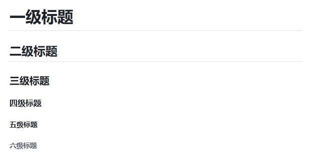
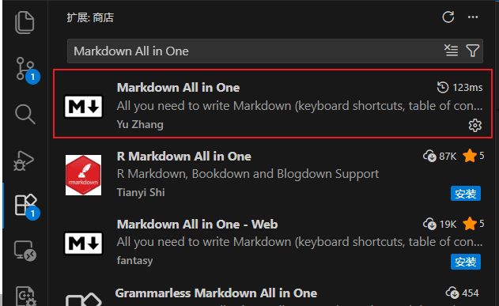
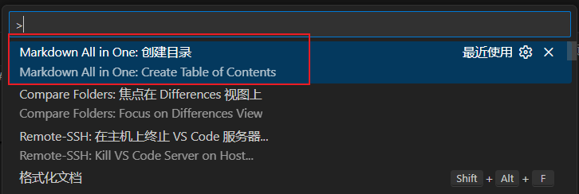

# 一、标题

[返回文档首页](../README.md)

## 1.1 标题

Markdown标题有以下几种格式：

1. 使用 = 和 - 符号来标记一级和二级标题；
2. 使用 #  号标记标题
3. 使用HTML中的`<h1>`到`<h6>`标签


### 1.1.1 Markdown语法实现方式

Markdown语法支持的标题有以下几种格式：
1. 使用 `=` 和 `-` 符号来标记一级和二级标题；
2. 使用 `# ` 号标记标题

<br/>

#### 方法一：使用 `=` 和 `-` 符号来标记一级和二级标题

注意：

1. 使用 `=` 和 `-` 符号来标记一级和二级标题，在GFM中显示是正常的，但是在一些Markdown编辑器中可能渲染失败，例如Typora。推荐使用 `#` 号标记来创建标题。

<br/>

案例：

```markdown
一级标题
=
二级标题
-
```

<br/>

显示效果如下：

> 一级标题
> =
> 二级标题
> -

<br/>

运行截图如下：


<br/>

#### 方法二：使用 `#` 号标记

Markdown 使用 `#` 号来创建标题，这是从 HTML 的 `<h1>` 到 `<h6>` 标签概念演化而来的。

使用 `#` 号可表示 1-6 级标题，一级标题对应一个 `#` 号，二级标题对应两个 `#` 号，以此类推。

<br/>

案例：

```markdown
# 一级标题
## 二级标题
### 三级标题
#### 四级标题
##### 五级标题
###### 六级标题
```

<br/>

显示效果如下：

> # 一级标题
> ## 二级标题
> ### 三级标题
> #### 四级标题
> ##### 五级标题
> ###### 六级标题

<br/>

运行截图如下：



<br/>

### 1.1.2 HTML标签实现方式

HTML使用`<h1>`到`<h6>`标签来实现不同的标题等级。

案例：

```markdown
<h1>一级标题</h1>
<h2>二级标题</h2>
<h3>三级标题</h3>
<h4>四级标题</h4>
<h5>五级标题</h5>
<h6>六级标题</h6>
```

<br/>

显示效果如下：

> <h1>一级标题</h1>
> <h2>二级标题</h2>
> <h3>三级标题</h3>
> <h4>四级标题</h4>
> <h5>五级标题</h5>
> <h6>六级标题</h6>

### 1.1.3 LaTeX实现方式

LaTeX中存在多种章节标签来定义文档的结构，常见的命令有`\chapter{}`, `\section{}`, `\subsection{}`, `\subsubsection{}`, `\paragraph{}`, `\subparagraph{}`, `\part{}`等。

```latex
\documentclass{report}

\begin{document}
\chapter{一级结构}
\section{二级结构}
\subsection{三级结构}
\subsubsection{四级结构}
\paragraph{段落标题}
\end{document}
```

注意：在GFM中不支持这种实现方式。

## 1.2 目录生成

### 1.2.1 Markdown语法实现方式

#### 方法一：TOC语法

`[TOC]` 是许多 Markdown 编辑器和渲染器支持的非标准扩展语法，用于在文档开头自动生成基于 `#` 标题的目录。然而，`GitHub Flavored Markdown (GFM) `并不支持使用`[TOC]` 自动生成目录。在指定段落中，输入`[TOC]` 即可渲染展示当前Markdown文件的目录。

非标准扩展语法，不推荐使用。

<br/>

案例：

```markdown
[TOC]
```

<br/>

显示效果如下：

> [TOC]

<br/>

#### 方法二：链接方式制作目录

虽然大多数 Markdown 处理器会自动为标题创建锚点，便于页面内跳转，并在这个基础上结合列表实现了目录（即目录链接）。

<br/>

语法：

```markdown
[标题显示名称](#标题实际跳转的名称)
```

<br/>

案例：

```markdown
- [一、标题](#一标题)
  - [1.1 标题](#11-标题)
```

<br/>

显示效果如下：

> - [一、标题](#一标题)
>   - [1.1 标题](#11-标题)

<br/>

#### 方法三：使用插件制作目录

以VS Code为例，`Markdown All in One`​ 是 VS Code 中功能强大的 Markdown 增强插件，提供了自动生成和更新目录的功能。

<br/>

安装步骤：

1. 打开VS Code
2. 进入扩展市场（快捷键：Ctrl+Shift+X）
3. 搜索 `Markdown All in One`, 点击安装

<br/>

使用步骤：

1. 打开要添加目录的 Markdown 文件
2. 按下快捷键：`Ctrl + Shift + P` 打开命令面板
3. 输入 `Create Table of Contents` 并选择该命令
4. 插件会在当前光标位置自动生成目录

`Markdown All in One` 支持修改文档标题后，目录会自动同步更新。

<br/>

操作步骤：

> 搜索 `Markdown All in One` 图片：
>
> 
>
> 输入 `Create Table of Contents` 生成目录图片：
>
> 

### 1.2.2 HTML标签实现方式

HTML可以使用导航列表和显式`id`属性制作目录。与GitHub自动生成的标题锚点相比，显式`id`更容易保持长期稳定。

```html
<nav aria-label="文档目录">
  <ul>
    <li><a href="#overview">概述</a></li>
    <li><a href="#usage">使用方法</a></li>
  </ul>
</nav>

<h2 id="overview">概述</h2>
<h2 id="usage">使用方法</h2>
```

GitHub会过滤部分HTML属性；在GitHub文档中通常仍建议使用Markdown标题和锚点链接。

### 1.2.3 LaTeX实现方式

完整LaTeX文档可以使用`\tableofcontents`根据章节命令自动生成目录。

```latex
\documentclass{article}

\begin{document}
\tableofcontents

\section{概述}
正文内容。

\section{使用方法}
正文内容。
\end{document}
```

通常需要编译两次，目录页码和章节引用才会更新。GitHub数学公式渲染器不会执行`\tableofcontents`。
