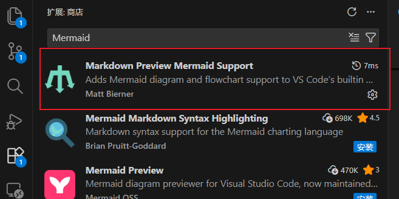
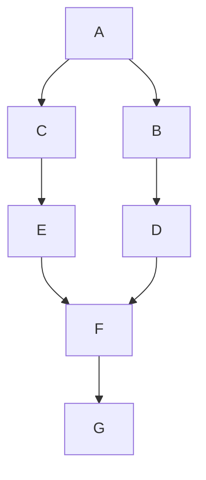
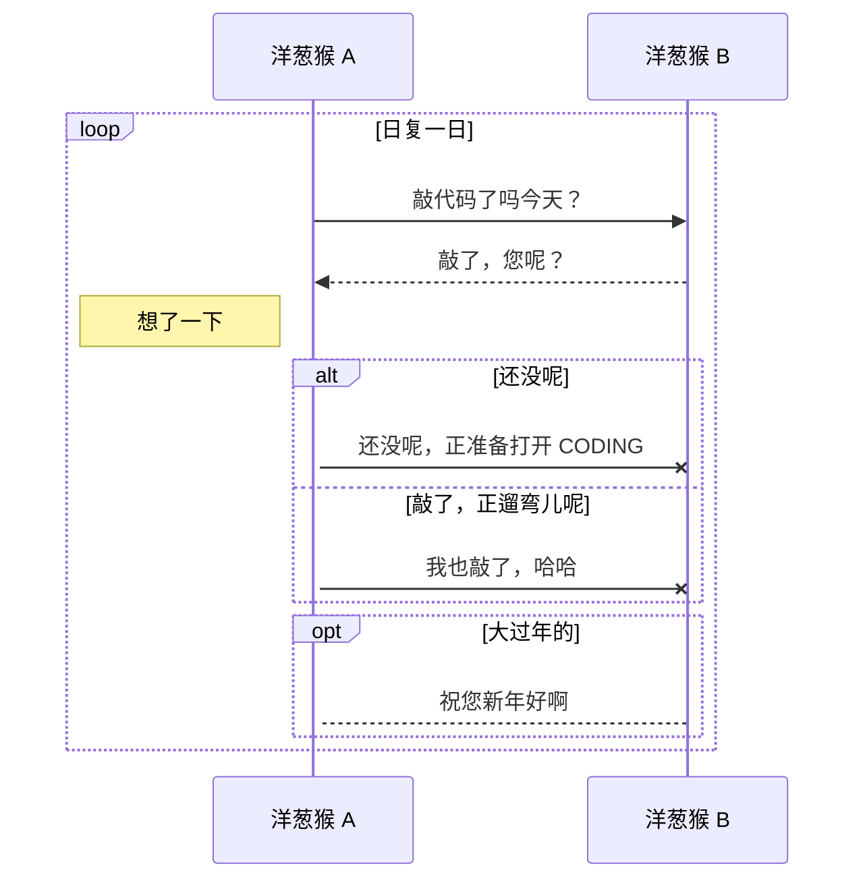
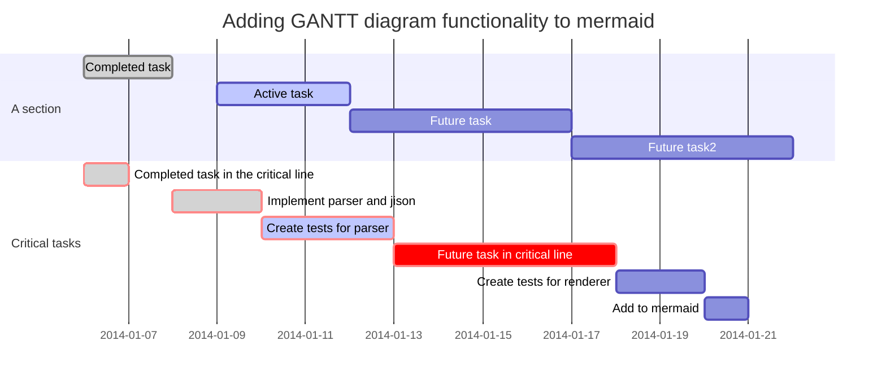
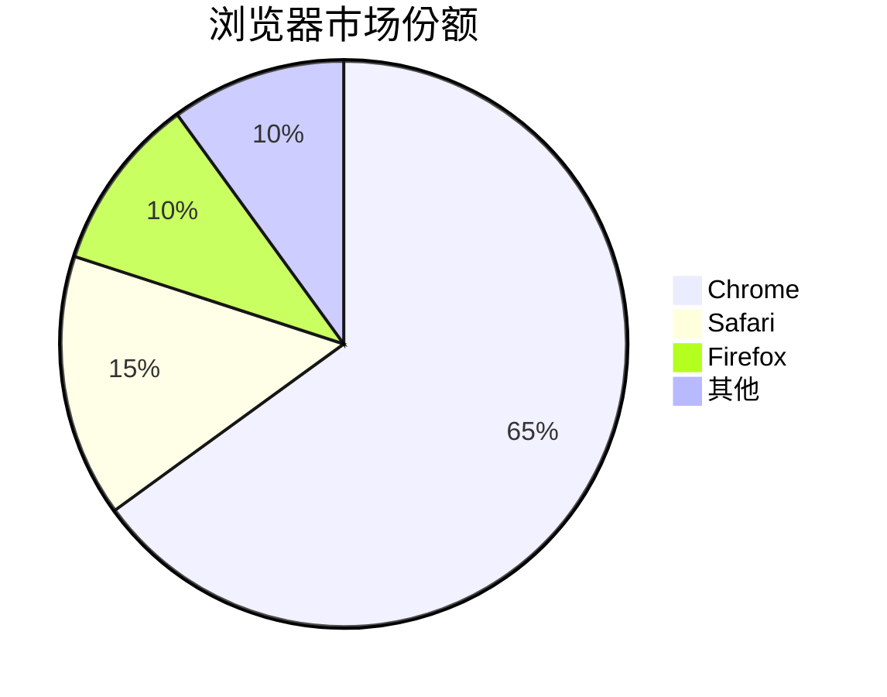
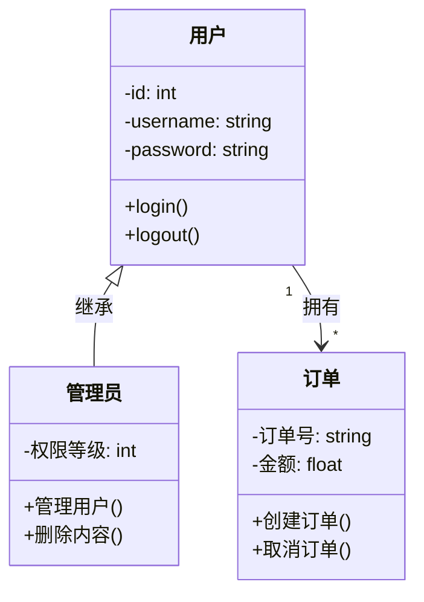
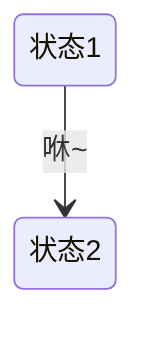

# 五、图片

[返回文档首页](../README.md)

在Markdown中，除了用``语法插入静态图片外，GitHub平台还可以渲染Mermaid、GeoJSON、TopoJSON和ASCII STL代码块。

## 5.1 插入静态图片

在Markdown中插入图片存在以下方式：

+ 图片链接：具体实现详见4.3节
+ HTML标签：使用``标签

使用图片链接的方法是目前还没有办法指定图片的高度和宽度，因此，如果需要指定图片宽度和高度的话，可以使用``标签。

### 5.1.1 图片链接

详见4.3节

<br/>

### 5.1.2 HTML标签

案例：

```markdown

```

显示效果如下：

> 

具体的标签功能可以查看HTML的语法。

<br/>

### 5.1.3 LaTeX实现方式

完整LaTeX文档使用`graphicx`宏包的`\includegraphics`插入静态图片。

```latex
\usepackage{graphicx}

\includegraphics[width=0.5\textwidth]{example.png}
```

可以使用`width`、`height`、`scale`和`angle`等参数控制尺寸与旋转。GitHub数学公式不会执行`\includegraphics`，GitHub文档应继续使用Markdown或HTML图片语法。

## 5.2 插入动态图片

Mermaid是文本化图表语言。GitHub可以识别带有`mermaid`语言标识符的围栏代码块并渲染图表，但Mermaid不属于CommonMark或正式GFM规范。

不同载体的实现方式如下：

| 载体 | 推荐实现 |
| --- | --- |
| Markdown/GitHub | 使用`mermaid`、`geojson`、`topojson`或`stl`围栏代码块。 |
| HTML | 使用导出的SVG/PNG，或在独立网页中加载对应JavaScript库；GitHub不会执行任意脚本。 |
| LaTeX | 使用TikZ、PGFPlots等宏包重新绘制，或插入导出的PDF/PNG/SVG。 |

支持的图表类型

- **流程图** (Flowchart) - 展示流程和决策路径
- **时序图** ( Sequence Diagram) - 显示对象间交互的时间顺序
- **甘特图** (Gantt Chart) - 项目管理和时间规划
- **饼图** (Pie Chart) - 数据占比可视化
- **类图** (Class Diagram) - 面向对象系统结构
- **状态图** (State Diagram) - 系统状态转换
- 更多图表类型详见 5.2.1-5.2.6 节

<br/>

安装步骤：

1. 打开VS Code
2. 进入扩展市场（快捷键：Ctrl+Shift+X）
3. 在搜索栏中输入 `Mermaid`，推荐安装插件`Markdown Preview Mermaid Support`，然后点击安装
4. 重新启动VS Code, 在Markdown文件，点击预览即可出现对应的图表

运行截图如下：



此外，还有一些图也支持，例如flow流程图。

<br/>

### 5.2.1 流程图

案例：

````markdown

````

显示效果如下：


<br/>

### 5.2.2 时序图

案例：

````markdown

````

显示效果如下：


<br/>

### 5.2.3 甘特图

案例：

````markdown

````

显示效果如下：


<br/>

### 5.2.4 饼图

案例：

````markdown

````

显示效果如下：


<br/>

### 5.2.5 类图

案例：

````markdown

````

显示效果如下：


<br/>

### 5.2.6 状态图

案例：

````markdown

````

显示效果如下：


<br/>

### 5.2.7 flow流程图

Mermaid不支持下面语法，但是部分Markdown编辑器支持，例如Typora。

案例：

````markdown
```flow
st=>start: 开始框
op=>operation: 处理框
cond=>condition: 判断框(是或否?)
sub1=>subroutine: 子流程
io=>inputoutput: 输入输出框
e=>end: 结束框
st(right)->op(right)->cond
cond(yes)->io(bottom)->e
cond(no)->sub1(right)->op
```
````

显示效果如下：

```flow
st=>start: 开始框
op=>operation: 处理框
cond=>condition: 判断框(是或否?)
sub1=>subroutine: 子流程
io=>inputoutput: 输入输出框
e=>end: 结束框
st(right)->op(right)->cond
cond(yes)->io(bottom)->e
cond(no)->sub1(right)->op
```

<br/>

### 5.2.8 GeoJSON地图

GitHub可以在支持的文档位置渲染GeoJSON地图。代码块的语言标识符使用`geojson`。

````markdown
```geojson
{
  "type": "FeatureCollection",
  "features": [
    {
      "type": "Feature",
      "properties": {},
      "geometry": {
        "type": "Point",
        "coordinates": [116.4074, 39.9042]
      }
    }
  ]
}
```
````

坐标顺序为经度、纬度。实际使用时应避免在地图数据中包含敏感位置。

### 5.2.9 TopoJSON地图

TopoJSON通过共享边界减少重复坐标，适合表示多个相邻区域。代码块的语言标识符使用`topojson`。

````markdown
```topojson
{
  "type": "Topology",
  "objects": {
    "example": {
      "type": "GeometryCollection",
      "geometries": []
    }
  },
  "arcs": []
}
```
````

### 5.2.10 ASCII STL三维模型

GitHub可以渲染ASCII STL格式的三维模型。代码块的语言标识符使用`stl`。

````markdown
```stl
solid triangle
  facet normal 0 0 1
    outer loop
      vertex 0 0 0
      vertex 1 0 0
      vertex 0 1 0
    endloop
  endfacet
endsolid triangle
```
````

该功能仅适用于ASCII STL文本，二进制STL不能直接放入代码块渲染。

## 5.3 特殊图片

除常见的PNG、JPEG和GIF外，GitHub文档还可以引用SVG图片。SVG适合图标和结构图，但引用不可信的外部SVG时应注意其来源。

建议优先使用仓库内的相对路径，便于分支、Fork和离线阅读：

```markdown

```

图片说明应准确描述图片内容，避免使用“图片”“截图”等无信息量文本。
