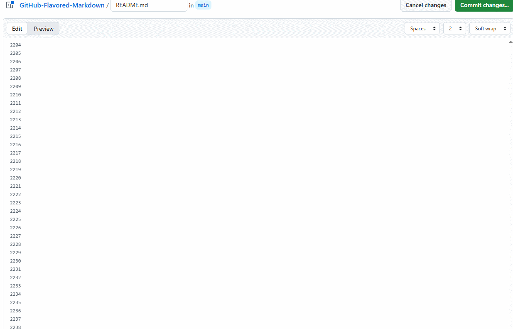
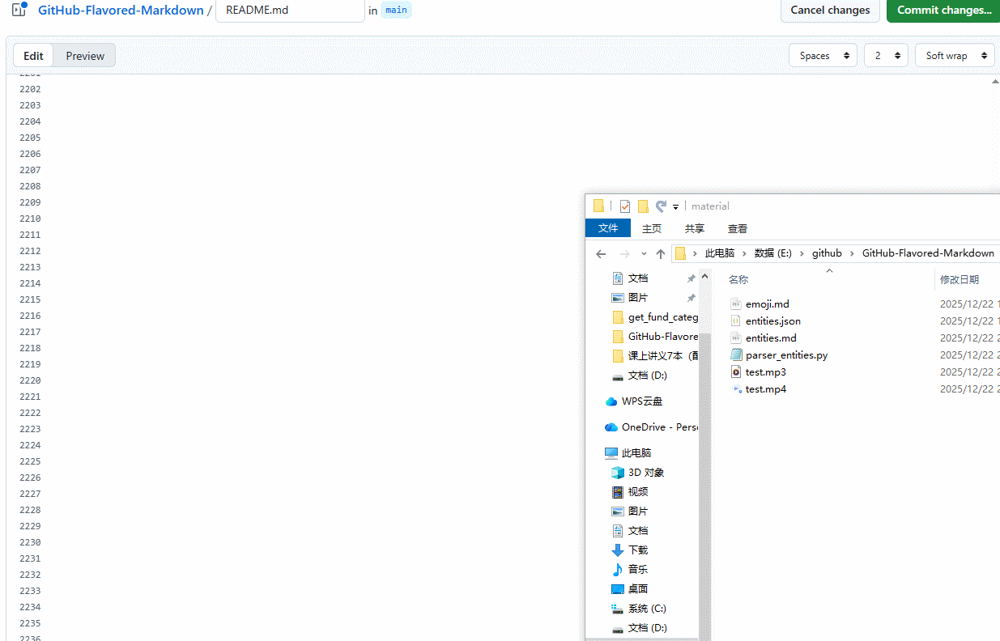

# 八、GitHub常见的组件

[返回文档首页](../README.md)

本章介绍GitHub平台常见组件，其中很多内容不属于CommonMark或正式GFM。对于HTML和LaTeX没有等价交互能力的功能，应使用静态图片、普通链接或文字说明替代。

| 功能 | Markdown/GitHub | HTML替代 | LaTeX/PDF替代 |
| --- | --- | --- | --- |
| Emoji和字符引用 | Emoji短代码、Unicode、HTML字符引用 | Unicode或字符引用 | 直接输入Unicode，或使用符号宏包 |
| 徽章和数据图 | 图片加链接 | `<a>`包裹`` | `\href`包裹`\includegraphics` |
| 折叠 | 使用允许的`<details>`标签 | `<details>`和`<summary>` | 无原生交互折叠，可改用附录或分节 |
| 视频和音频 | GitHub附件或普通文件链接 | `<video>`、`<audio>` | 通常使用外部链接或静态封面，不建议嵌入多媒体 |

## 8.1 表情和符号

### 8.1.1 emoji表情

来源：[参考网址](https://github.com/guodongxiaren/README)

GitHub的Markdown语法支持添加emoji表情，输入不同的符号码（两个冒号包围的字符）可以显示出不同的表情。

比如 `:blush:`，可以显示 :blush:。

具体每一个表情的符号码，可以查询GitHub的官方网页<http://www.emoji-cheat-sheet.com>。

但是这个网页每次都打开奇慢。。所以我整理到了本repo中，大家可以直接在此查看[emoji](../material/emoji.md)。

<br/>

### 8.1.2 HTML字符

GitHub的Markdown语法支持添加HTML支持的字符引用

比如 `&laquo;`, 显示为  &laquo;。

来源：[参考网址](https://html.spec.whatwg.org/multipage/named-characters.html#named-character-references)

但是这个网页每次都打开奇慢。。所以我整理到了本repo中，大家可以直接在此查看[entities](../material/entities.md)。

<br/>

### 8.1.3 特殊符号

Markdown还支持其他的特殊符号，这个可以在一些提供特殊符号的网址上复制接口。

比如 `❿` 显示为❿。

参考链接：
1. https://www.iamwawa.cn/fuhao.html
2. https://m.weixinbiaoqing.com/

<br/>

## 8.2 diff代码块

`diff`不是独立的GFM语法扩展，而是围栏代码块的语言标识符。GitHub使用语法高亮器按统一差异格式显示内容。

可以通过以下方式插入`diff`代码块：
1. 使用三个反引号（```）开始一个代码块，然后在反引号后面写上“diff”
2. 按统一差异格式编写内容：以`+`开头表示新增，以`-`开头表示删除，`@@ ... @@`表示变更区段，其余行为上下文。

具体颜色由GitHub主题和语法高亮器决定，不应依赖固定色值。`!`和`#`不是统一差异格式中表示“修改”或“删除”的通用行前缀。

<br/>

案例：

````markdown
```diff
@@ -1,5 +1,5 @@
-夜静春山空。
+人闲桂花落。
 月出惊山鸟，
 时鸣春涧中。
```
````

显示效果如下：

> ```diff
> @@ -1,5 +1,5 @@
> -夜静春山空。
> +人闲桂花落。
>  月出惊山鸟，
>  时鸣春涧中。
> ```

<br/>

## 8.3 徽章

徽章不是GFM特有语法。它通常是第三方服务生成的图片，再通过普通Markdown图片或图片链接语法嵌入。能否显示还取决于外部图片服务、网络策略和链接是否长期有效。

+ https://shields.io/

<br/>

案例：

```markdown
# 基础徽章


# 为徽章添加 img.shield.io 链接
[](https://img.shields.io)

```

显示效果如下：

> 基础徽章
>
> 
>
>
> 为徽章添加 img.shield.io 链接
>
> [](https://img.shields.io)

<br/>

常见的徽章使用场景包括：

+ 构建与集成状态（CI/CD)，例如 `BUILD: PASSING`， `CI: passing`
+ 测试覆盖率与质量
+ 版本与发布信息，例如React版本，python版本，License版本， release版本等
+ 下载量与流行度，例如star数量，issue数量（开放的数量，关闭的数量），fork数量，贡献者的数量，下载数量等
+ 兼容性信息，支持ubuntu啥的
+ 文档与聊天渠道，例如docs，微信群，知乎，微博，新浪，gitlab等
+ 其他用途，例如demo，sponsor(赞赏)等

<br/>

### 8.3.1 构建与集成状态

在 `shield.io` 网址中,
+ 点击 `Badges` -> `Static Badge`，在这个列表中可以看到对应的GitHub仓库数据徽章制作方式

<br/>

语法：

+ `badgeContent (必选)` : 一般由左侧的标签和右侧的消息组成, 标签，消息，颜色中间用破折号分割: label-message-color。
+ `style (可选)` : 可选，---，flat（扁平）, flat-square（扁平方形）, plastic（塑料质感）, for-the-badge（徽章专用样式）, social（社交风格）。
+ `logo (可选)` : 图标标识符（slug）来自 simple-icons。您可以通过点击 simple-icons 网站上的图标标题来复制其标识符，也可在 simple-icons 代码库的 slugs.md 文件中找到。来源于 <https://simpleicons.org/>。
+ `logoColor (可选)` : 该颜色适用于Logo（支持十六进制、RGB、RGBA、HSL、HSLA格式及CSS命名颜色）。此功能适用于simple-icons图标库的Logo，不适用于自定义Logo。
+ `logoSize (可选)` : 通过设置 auto来使图标自适应调整大小。这对一些较宽的Logo（如AMD和AMG）非常有用。此功能适用于 `simple-icons` 的Logo，不适用于自定义Logo。
+ `label (可选)` : 覆盖默认的左侧文本（空格或特殊字符需进行URL编码！）
+ `labelColor (可选)` : 左侧部分的背景颜色（支持十六进制、RGB、RGBA、HSL、HSLA格式及CSS命名颜色）。
+ `color (可选)` : 右侧部分的背景颜色（支持十六进制、RGB、RGBA、HSL、HSLA格式及CSS命名颜色）。
+ `cacheSeconds (可选)` : HTTP缓存生命周期（系统将根据每个徽章的规则自动推断默认值，任何低于该默认值的设置将被忽略）。
+ `link (可选)` : 指定点击徽章左侧/右侧时应执行的操作。请注意，此功能仅在将徽章集成到 `<object>` HTML 标签中时有效，而在 `` 标签或标记语言中无效。

<br/>

案例：

```markdown
# 设置了logo和style的徽章


```

显示效果如下：

> 
> 

<br/>

### 8.3.2 测试覆盖率与质量

在 `shield.io` 网址中,
+ 点击 `Badges` -> `Static Badge`，在这个列表中可以看到对应的GitHub仓库数据徽章制作方式

案例：

```markdown
# badgeContent案例：
coverage-95%25-orange
just%20the%20message-8A2BE2
any_text-you_like-blue
github-repo-blue?logo=github
```

显示效果如下：

> 
> 
> 
> 

<br/>

### 8.3.3 版本与发布信息

在 `shield.io` 网址中,
+ 点击 `Badges` -> `License`，在这个列表中可以看到对应的GitHub仓库数据徽章制作方式
+ 点击 `Badges` -> `Funding` -> `GitHub Sponsors`，在这个页面可以看到对应的GitHub仓库贡献者数量徽章制作方法

<br/>

以 <https://github.com/cjc-github/GitHub-Flavored-Markdown> 为例，各个参数为：

+ user: cjc-github
+ repo: GitHub-Flavored-Markdown
+ org: cjc-github

然后获取生成的Markdown语法，复制到MD文件中。

<br/>

案例：

```markdown
# License

# GitHub sponsors

# Next.js版本 + 跳转链接
[](https://nextjs.org/)
# react版本 + 跳转链接
[](https://react.dev/)
```

显示效果如下：

> 
> 
> [](https://nextjs.org/)
> [](https://react.dev/)

<br/>

### 8.3.4 GitHub仓库数据

在 `shield.io` 网址中，点击 `Badges` -> `Social`，在这个列表中可以看到对应的GitHub仓库数据徽章制作方式

以 <https://github.com/cjc-github/GitHub-Flavored-Markdown> 为例，各个参数为：

+ user: cjc-github
+ repo: GitHub-Flavored-Markdown
+ org: cjc-github

然后获取生成的Markdown语法，复制到MD文件中。

案例：

```markdown
# GitHub followers


# GitHub forks


# GitHub Org's stars


# GitHub Repo stars


# GitHub User's stars


# GitHub watchers

```

显示效果如下：

> 
> 
> 
> 
> 
> 

<br/>

注意：这些徽章一般会和对应的链接组合使用，以用户star为例

```markdown
# 在GitHub上面获取到star的链接地址
[](https://github.com/cjc-github/GitHub-Flavored-Markdown/stargazers)
```

显示效果如下：

> [](https://github.com/cjc-github/GitHub-Flavored-Markdown/stargazers)

<br/>

### 8.3.5 兼容性信息

直观展示该Git仓库的一些软件或者系统的兼容性。

案例：

```markdown
# Django兼容性


# Node.js兼容性
[](https://nodejs.org)

# python3.7+兼容性
[](https://www.python.org)

# 各个版本的兼容性

```

显示效果如下：

> 
> [](https://nodejs.org)
> [](https://www.python.org)
> 

<br/>

### 8.3.6 文档与聊天渠道

在 GitHub 的 Markdown 中使用社交媒体与社区徽章的核心作用是通过视觉化徽章引导用户进入项目社区，从而提高该Git仓库参与度和社区活跃度。这些徽章不仅仅是装饰，而是关键的聊天入口。

案例：

```markdown
# QQ


# 微信


# 知乎


# 微博


# github


# 小红书


# 豆瓣


# 抖音


# B站


# 快手

```

显示效果如下：

> 
> 
> 
> 
> 
> 
> 
> 
> 
> 

<br/>

### 8.3.7 其他用途

徽章还可以实现各种各样的用途，例如：

```markdown
# project徽章
[](https://microsoft.github.io/VibeVoice)

# hugging face徽章
[](https://huggingface.co/collections/microsoft/vibevoice-68a2ef24a875c44be47b034f)

# teachnical report徽章
[](https://arxiv.org/pdf/2508.19205)

# status new徽章


# feature-realtime徽章


# 回到目录的徽章
[](../README.md#文档目录)

# 回到目录的徽章
[](../README.md#文档目录)
```

显示效果如下：

> [](https://microsoft.github.io/VibeVoice)
> [](https://huggingface.co/collections/microsoft/vibevoice-68a2ef24a875c44be47b034f)
> [](https://arxiv.org/pdf/2508.19205)
> 
> 
> [](../README.md#文档目录)
> [](../README.md#文档目录)

<br/>

## 8.4 GitHub数据图

### 8.4.1 star历史图

Star History可以查询GitHub仓库的Star数量变化。旧版匿名SVG接口可能返回HTTP 500或因GitHub API限制而无法生成图片，因此不应把未经验证的`api.star-history.com`地址直接嵌入README。

使用方法：

1. 打开Star History网站并输入`owner/repository`。
2. 如果网站要求GitHub访问令牌，按照页面提示授权；不要把令牌写入Markdown、图片URL或Git历史。
3. 需要长期稳定展示时，将生成的图表导出为SVG或PNG并提交到仓库，然后使用相对路径引用。
4. 不需要在README中直接显示图表时，使用普通链接跳转到Star History页面。

普通链接案例：

```markdown
[查看本仓库的Star历史](https://www.star-history.com/#cjc-github/GitHub-Flavored-Markdown&Date)
```

显示效果如下：

[查看本仓库的Star历史](https://www.star-history.com/#cjc-github/GitHub-Flavored-Markdown&Date)

仓库内静态图案例：

```markdown
[](https://www.star-history.com/)
```

显示效果如下：

[](https://www.star-history.com/)

本仓库中的图片是用于验证GitHub显示效果的静态示例，不代表实时Star数据。实际项目应从图表服务导出最新SVG或PNG并替换该文件；不要直接复制已经失效的旧匿名API地址。

<br/>

### 8.4.2 contribution贡献图

GitHub仓库的contribution贡献可以已有的网站：https://contrib.rocks/

使用方法：
在上述网址中，输入需要显示 `user/repo` 的github仓库地址，然后复制生成的链接即可。

<br/>

以 <https://github.com/cjc-github/GitHub-Flavored-Markdown> 为例，各个参数为：

+ user: cjc-github
+ repo: GitHub-Flavored-Markdown
+ org: cjc-github

然后输入 `cjc-github/GitHub-Flavored-Markdown` 获取生成的Markdown语法，复制到MD文件中。

<br/>

案例：

```markdown
Thanks to all contributors:

<a href="https://github.com/cjc-github/GitHub-Flavored-Markdown/graphs/contributors">
  
</a>
```

显示效果如下：

> Thanks to all contributors:
>
> <a href="https://github.com/cjc-github/GitHub-Flavored-Markdown/graphs/contributors">
>   
> </a>

注意：这个贡献图会自动跳转到GitHub仓库的 `/graphs/contributors` 路径

<br/>

## 8.5 折叠

折叠作为一种常见的UI交互模式，指的是通过交互控制部分内容的显示与隐藏。Markdown中虽然不支持，但可以使用HTML语言中的`<details>`标签实现折叠功能。可以将非核心内容默认隐藏，使界面更简洁，非常适合FAQ、长文档、设置面板等场景。

案例：

```html
<details>
<summary>问题1: 折叠功能如何使用？</summary>

 回答：

 就是这么使用的
</details>
```

显示效果如下：

> <details>
> <summary>问题1: 折叠功能如何使用？</summary>
>
>  回答：
>
>  就是这么使用的
> </details>

<br/>

## 8.6 视频

### 8.6.1 GitHub上传视频

在GitHub编辑器中拖放或选择受支持的视频文件后，GitHub会生成匿名化附件URL，并在支持附件的Markdown上下文中展示视频。该能力属于GitHub平台的附件功能，不是正式GFM语法；常见支持格式包括MP4、MOV和WebM，实际播放还受浏览器编码支持影响。

案例：

```markdown
https://github.com/user-attachments/assets/3297aadd-456a-47ce-b21f-1edbecd8cfbc
```

显示效果如下：

> https://github.com/user-attachments/assets/3297aadd-456a-47ce-b21f-1edbecd8cfbc

操作步骤的动画:



<br/>

### 8.6.2 HTML的视频标签

独立HTML页面可以使用`<video>`标签嵌入MP4等视频，但GitHub渲染Markdown时不会可靠保留这类播放器标签。

**GitHub不支持：** 以下代码仅用于说明独立HTML写法，在GitHub Markdown中不要依赖它产生播放器。

案例：

```markdown
<video controls width="600">
  <source src="../material/test.mp4" type="video/mp4">
  您的浏览器不支持HTML5 video标签。
</video>
```

GitHub渲染本页时不会显示上述播放器；独立HTML页面中的效果应在浏览器中验证。

<br/>

## 8.7 音频

### 8.7.1 GitHub上传音频

GitHub可以在部分评论和Discussion上下文中接收受支持的音频附件，但通常将其作为附件链接，而不是在Markdown正文中提供通用音频播放器。仓库内已有的音频文件也应使用普通链接。

**注意：**
如果需要在GitHub页面中提供音频，推荐链接音频附件或外部播放页面。仓库中的独立HTML文件通常以源码形式查看，不应把它当作GitHub Markdown内嵌播放器的替代方案。

案例：

```markdown
[test.mp3](../material/test.mp3)
```

显示效果如下：

[test.mp3](../material/test.mp3)

操作步骤的动画:



<br/>

### 8.7.2 HTML的音频标签

独立HTML页面可以使用`<audio>`标签嵌入MP3等音频，但GitHub渲染Markdown时不会可靠保留这类播放器标签。

**GitHub不支持：** 以下代码仅用于说明独立HTML写法，在GitHub Markdown中不要依赖它产生播放器。

案例：

```markdown
<audio controls>
  <source src="../material/test.mp3" type="audio/mpeg">
  您的浏览器不支持HTML5 audio标签。
</audio>
```

GitHub渲染本页时不会显示上述播放器；独立HTML页面中的效果应在浏览器中验证。

<br/>
